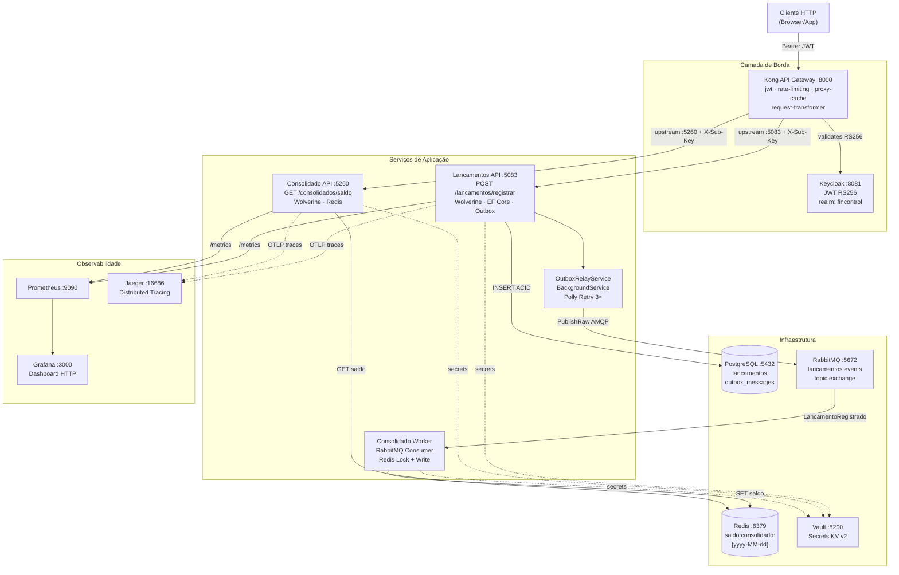

# 🏗️ Architecture - Cash Flow Management System

**Project:** FinControl — Cash Flow Management System for Merchants  
**Date:** May 2026  
**Version:** 3.0 — Production Implementation

---

## Implementation Status

> This documentation has been updated to reflect the **implemented** state of the project (v2.0).  
> The justification and volumetry sections remain as architectural reference.

### What is Implemented

| Component | Status | Notes |
|-----------|--------|-------|
| **FinControl.Lancamentos.API** | ✅ Functional | `POST /lancamentos/registrar` + Wolverine handlers + Vault + JWT |
| **FinControl.Lancamentos.Core** | ✅ Functional | CQRS via Wolverine, FluentValidation, EF Core, Manual Outbox |
| **FinControl.Consolidado.API** | ✅ Functional | `GET /consolidados/saldo?data-lancamento=yyyy-MM-dd` via Redis |
| **FinControl.Consolidado.Core** | ✅ Functional | Command + Query handlers via Wolverine |
| **FinControl.Consolidado.Worker** | ✅ Functional | Direct RabbitMQ Consumer → updates Redis |
| **FinControl.Infrastructure** | ✅ Functional | Cache, Lock, Vault, Middleware, Observability, RabbitMqPublisher |
| **FinControl.SharedKernel** | ✅ Functional | Base entities, events, typed result |
| **FinControl.Auth** | ✅ Functional | Keycloak integration (JWT Bearer) |
| **HashiCorp Vault** | ✅ Integrated | Secrets loaded via `VaultConfigurationProvider` |
| **Redis (Cache + Lock)** | ✅ Integrated | `RedisCacheService` + `IRedisLockService` (SETNX + Lua) |
| **RabbitMQ (Manual Outbox)** | ✅ Integrated | `OutboxMessage` in PostgreSQL + `OutboxRelayService` (BackgroundService) |
| **OutboxRelayService + Polly** | ✅ Implemented | Polling 5s, batch 50, retry 3× exponential with jitter |
| **RabbitMqPublisher** | ✅ Implemented | Direct AMQP publisher (reusable building block) |
| **PostgreSQL + Migrations** | ✅ Integrated | Auto-apply on startup (fail-fast), `AddOutboxMessages` applied |
| **Idempotency** | ✅ Implemented | `IdempotencyKey` (UUID) + unique index in DB |
| **Soft Delete** | ✅ Implemented | Global query filter `DeletedAt == null` |
| **SubscriptionKeyMiddleware** | ✅ Implemented | Second layer after Kong; bypass `/health` and `/metrics` |
| **Kong request-transformer** | ✅ Configured | Kong injects `X-Subscription-Key` automatically — never exposed to client |
| **Kong JWT (RS256 + Keycloak)** | ✅ Configured | Keycloak public key registered as JWT credential in Kong |
| **Grafana Dashboard** | ✅ Provisioned | HTTP Dashboard provisioned via JSON (`fincontrol-http-v1`) |
| **Prometheus /metrics** | ✅ Functional | `prometheus-net` exposes metrics at `/metrics` (both APIs) |
| **Automated Tests** | ✅ 83 tests | 48 (Lancamentos) + 35 (Consolidado), zero failures |
| **FinControl.StressTests** | ✅ Implemented | NBomber 5.5.0 — 50 req/s (Consolidado) + 10 req/s (Lancamentos) in parallel; JWT auto-fetch from Keycloak; HTML + Markdown reports |

### Open Items (Roadmap)

| Item | Reason Deferred |
|------|-----------------|
| `totalCredits`/`totalDebits` in consolidated balance | Response model redesign |
| `Lancamento` inherit `AggregateRoot<long>` | Larger refactoring scope |
| Deduplication of `ModalidadeLancamento` (duplicate enum) | Impact on cast `(ModalidadeLancamento)(int)` |
| Public setters → encapsulation in `Lancamento` | Anemic model — domain refactoring |

---

## Table of Contents

1. [Requirements](#requirements)
2. [Volumetry Analysis](#volumetry-analysis)
3. [Technology Justifications](#technology-justifications)
   - 3.1 [Why Microservices?](#why-microservices)
   - 3.2 [Why Redis Cache?](#why-redis-cache-is-essential)
   - 3.3 [Why PostgreSQL?](#why-postgresql-not-dynamodbcassandra)
   - 3.4 [Why RabbitMQ?](#why-rabbitmq-not-kafkaaws-sqs)
   - 3.5 [Why Kong (API Gateway)?](#why-kong-or-nginxhaproxy-for-api-gateway)
   - 3.6 [Why CQRS?](#why-cqrs-command-query-responsibility-segregation)
   - 3.7 [Why Modular Monolith?](#why-start-with-modular-monolith-vertical-slicing)
4. [Architectural Evolution: Vertical Slicing + CQRS](#architectural-evolution-vertical-slicing--cqrs)
5. [Proposed Architecture: Microservices + Event-Driven](#proposed-architecture-microservices--event-driven)
6. [Folder Structure](#folder-structure)
7. [Implementation: Vertical Slicing with Wolverine + Minimal APIs](#implementation-vertical-slicing-with-wolverine--minimal-apis)
8. [Applied Architectural Patterns](#applied-architectural-patterns)
9. [Tech Stack](#tech-stack)
10. [Main Components](#main-components)
11. [Data Flows](#data-flows)
12. [Non-Functional Requirements](#non-functional-requirements)
13. [Security](#security)
    - 13.1 [Authentication](#1-authentication)
    - 13.2 [Authorization](#2-authorization)
    - 13.3 [Input Validation](#3-input-validation)
    - 13.4 [Encryption in Transit](#4-encryption-in-transit)
    - 13.5 [Firewall & WAF (ModSecurity + Kong)](#5-firewall--waf-web-application-firewall)
    - 13.6 [Protection Against Attacks](#6-protection-against-attacks-summary)
14. [Key Vault & Secrets Management](#key-vault--secrets-management)
15. [Centralized Authentication & Authorization](#centralized-authentication--authorization)
16. [Monitoring & Observability](#monitoring--observability)
17. [Implementation Plan](#implementation-plan)
18. [Executive Summary: Vertical Slicing + CQRS for 50 req/s](#executive-summary-vertical-slicing--cqrs-for-50-reqs)
19. [Next Steps](#next-steps)
20. [References & Resources](#references--resources)

---

## Requirements

### Business Requirements
- ✅ Service that controls transactions (debits and credits)
- ✅ Daily consolidated service (consolidated balance report)

### Mandatory Technical Requirements
- ✅ Solution design documented
- ✅ Implementation in C#
- ✅ Automated tests
- ✅ Application of best practices (Design Patterns, SOLID, Architecture)
- ✅ README with execution instructions
- ✅ Hosting in public repository (GitHub)
- ✅ Complete documentation in repository

### Non-Functional Requirements
- **Resilience**: Lancamentos should remain available even if Consolidado goes down
- **Performance**: Consolidado receives **50 requests/second**
- **Reliability**: Maximum **5% request loss**

---

## Volumetry Analysis

### Business Assumptions

```
CRITICAL REQUIREMENT: 50 requests/second (consolidated)
└─ Peak limit established in the challenge
   With maximum 5% request loss allowed

Operating hours: 06:00 to 22:00 (16 hours/day)
Operating days: 360 days/year
Annual growth: 15% (branch expansion/volume)

WRITE ASSUMPTION (defensive — volume not specified in the challenge):
├─ The challenge does NOT define entry volume — assumption is an architectural decision
├─ In a real cash flow system, writes are the critical financial bottleneck
├─ Each entry requires: validation, ACID, idempotency, event publishing
└─ Adopted assumption: WRITE-HEAVY system (writes dominate in complexity and risk)

RESOURCE ALLOCATION MODEL:
├─ 70% of resources → Entry Service (writes, ACID, Outbox, events)
├─ 30% of resources → Consolidated Service (reads served ~99% by cache)
└─ Rationale: reads are O(1) via Redis; writes require complete pipeline
```

---

### Cálculo Realista: 50 req/s como Base

#### 1️⃣ Daily Read Requests (Consolidated)

```
Sustained peak scenario: 50 req/s
Distribution during the day: Concentrated in 16h of operation

CALCULATION:
Requests per hour:
  50 req/s × 3,600 seconds = 180,000 req/hour

Requests per day (16h operational):
  180,000 req/hour × 16 hours = 2,880,000 req/day

Requests per year (360 days):
  2,880,000 req/day × 360 days = 1,036,800,000 req/year

With 15% annual growth over 10 years:
┌──────┬─────────────────┬──────────────────┐
│ Year │ Req/s Rate      │ Req/Year         │
├──────┼─────────────────┼──────────────────┤
│  1   │ 50 req/s        │ 1,036,800,000    │
│  2   │ 57.5 req/s      │ 1,192,320,000    │
│  3   │ 66.1 req/s      │ 1,371,168,000    │
│  4   │ 76 req/s        │ 1,576,843,000    │
│  5   │ 87.4 req/s      │ 1,813,369,000    │
│  6   │ 100.5 req/s     │ 2,085,324,000    │
│  7   │ 115.6 req/s     │ 2,398,123,000    │
│  8   │ 133 req/s       │ 2,757,842,000    │
│  9   │ 153 req/s       │ 3,171,518,000    │
│ 10   │ 176 req/s       │ 3,647,246,000    │
└──────┴─────────────────┴──────────────────┘

TOTAL over 10 years: ~21,051,383,000 requests (approximately 21 billion).
```

---

#### 2️⃣ Impact of Redis Cache

```
WITHOUT CACHE:
├─ 50 req/s → 50 queries to PostgreSQL
├─ DB Latency: 20-50ms per query
├─ Bandwidth: ~5 MB/s (high)
├─ Database CPU: ~60-70% at peaks
└─ Practical limit: ~100 req/s before collapse

WITH REDIS CACHE — ACTIVE INVALIDATION BY EVENT (Write-Through):
├─ Strategy: cache refreshed for EACH entry registered
│  └─ Consumer listens to EntryRegistered → recalculates balance → SET Redis
├─ 50 req/s → Redis ✅
│  └─ ~99%+ resolved in <5ms (cache always fresh)
├─ ~0.5 req/s → PostgreSQL ❌
│  └─ Only cold start or consumer failure (DLQ + retry)
├─ Average latency: <5ms (cache hit) | 30ms (occasional miss)
├─ Database CPU: ~5-10% at peaks (-85%)
├─ Bandwidth: ~250 KB/s (-95%)
└─ Limit: ~500+ req/s (theoretical)

DIFFERENCE BETWEEN ACTIVE INVALIDATION vs PASSIVE TTL:
┌──────────────────────────────┬───────────────────────┬──────────────────────────┐
│ Characteristic               │ Passive TTL (60s)     │ Event-Driven (by write)  │
├──────────────────────────────┼───────────────────────┼──────────────────────────┤
│ Cache staleness (max.)       │ 60 seconds            │ 0 seconds                │
│ Expected hit rate            │ 95%                   │ 99%+                     │
│ Complexity                   │ Low                   │ Medium (consumer + Outbox)│
│ Risk of data inconsistency   │ High (60s lag)        │ Very low                 │
│ Write→Read coupling          │ None                  │ Asynchronous (via event) │
└──────────────────────────────┴───────────────────────┴──────────────────────────┘

QUANTIFIABLE SAVINGS:
┌─────────────────────────┬─────────┬─────────┬──────────┐
│ Metric                  │ No Cache│ With LRU│ Reduction│
├─────────────────────────┼─────────┼─────────┼──────────┤
│ Queries to DB/day       │ 2.88B   │ 0.014B  │ -99%     │
│ Database CPU at peaks   │ 70%     │ 10%     │ -85%     │
│ P99 Latency             │ 50ms    │ 5ms     │ -90%     │
│ DB connections needed   │ 200+    │ 10      │ -95%     │
│ Network bandwidth       │ 5 MB/s  │ 0.25MB/s│ -95%     │
│ Scalability             │ 100 r/s │ 500+ r/s│ +400%    │
└─────────────────────────┴─────────┴─────────┴──────────┘

Redis memory calculation needed:
├─ Consolidated balance per day: ~500 bytes
├─ Stores 90 days (useful period): 500B × 90 = 45 KB
├─ Security TTL: 24h (fallback if consumer fails)
├─ Overhead structures (meta): +5 KB
├─ TOTAL needed: ~60 KB !!!
└─ Recommendation: Minimum 512 MB (ensure margin)

Status: ✅ Redis ESSENTIAL to reach 50 req/s with <5% loss
        ✅ Active invalidation ensures real-time consistency
        ✅ Outbox Pattern protects against consumer failure
        ✅ ROI: Allows scaling without increasing DB
```

---

#### 3️⃣ Impacto no Load Balancer & Instâncias

```
REQUISIÇÕES DISTRIBUÍDAS:

Pico leitura: 50 req/s → Consolidado Service
Escrita: write-heavy (70% da complexidade operacional) → Lançamentos Service

CONSOLIDADO SERVICE (leitura via cache):
├─ Cache HIT (99%+): ~49,5 req/s → Resposta Redis <5ms
├─ Cache MISS (< 1%): < 0,5 req/s → Consulta BD (cold start)
├─ Carga efetiva no serviço: BAIXA (quase tudo retorna do Redis)
└─ CPU/Memória: mínimos — serviço age como proxy do Redis

Distribuição entre N servidores Consolidado:
┌─────────────────┬──────────────┬────────────────────────────┐
│ Servidores      │ Req/s p/ srv │ Utilização                 │
├─────────────────┼──────────────┼────────────────────────────┤
│ 1 servidor      │ 50 req/s     │ 30-40% (leve — tudo cache) │
│ 2 servidores    │ 25 req/s     │ 15-20% (muito confortável) │
└─────────────────┴──────────────┴────────────────────────────┘

RECOMENDAÇÃO: 1 servidor de Consolidado (+ auto-scaling horizontal)
├─ Com 99%+ de cache hit, 1 instância lida com 50 req/s com folga
├─ Failover: Redis replica (sem dependência de segunda instância)
├─ Health check a cada 10 segundos
└─ Auto-scaling: +1 servidor se CPU > 60% (raro com cache ativo)

LANÇAMENTOS SERVICE (escrita — 70% dos recursos):
├─ Pipeline: validação → ACID PostgreSQL → Outbox → evento RabbitMQ
├─ Cada escrita aciona atualização de cache (invalidação ativa)
├─ Requer: idempotência (IdempotencyKey), tratamento de concorrência
└─ Dois terminais podem criar lançamentos simultâneos → precisa de lock

Distribuição entre N servidores Lançamentos:
┌─────────────────┬──────────────┬────────────────────────────┐
│ Servidores      │ Carga        │ Utilização                 │
├─────────────────┼──────────────┼────────────────────────────┤
│ 2 servidores    │ 50% cada     │ Ativo-ativo, sem SPOF      │
│ 3 servidores    │ 33% cada     │ Margem ampla (produção)    │
└─────────────────┴──────────────┴────────────────────────────┘

RECOMENDAÇÃO: 2 servidores de Lançamentos (ativo-ativo)
├─ Pipeline de escrita é o crítico: falha aqui = perda de dados
├─ Outbox Pattern garante entrega do evento mesmo com crash
├─ PgBouncer (pool de conexões) protege PostgreSQL de spike de escrita
└─ Rate limiting per client: 10 req/s (protection against write DDoS)

Load Balancer (Nginx/HAProxy):
├─ Tráfego: 50 req/s leitura + escrita (não é desafio para LB)
├─ Limite de throughput: 10.000+ req/s (100x acima)
├─ Rate limiting: 60 req/s leitura | 10 req/s escrita por cliente
├─ Conexões simultâneas: 500-1000 (preparado para tudo)
└─ Recomendação: 1 instância LB (ou HA pair passivo)

Status: ✅ 1 × Consolidado + 2 × Lançamentos + 1 × LB = Solução write-optimized
        ✅ Consolidado leve (99% cache) → escalamento horizontal sob demanda
        ✅ Lançamentos robusto (2 instâncias ativo-ativo + Outbox)
```

---

#### 4️⃣ WRITE Requests (Entries)

```
ENTRIES — WRITE-HEAVY SYSTEM (critical operational bottleneck)
├─ Volume: not specified in challenge → free architectural assumption
├─ Adopted assumption: write-heavy (70% of infrastructure load)
├─ Each entry traverses complete pipeline (with CorrelationId at each stage):
│   ├─ 1. Business validation (type, value, date) — generates UUID CorrelationId
│   ├─ 2. Idempotency check (unique IdempotencyKey) — CorrelationId in logs
│   ├─ 3. ACID persistence in PostgreSQL — CorrelationId stored for audit
│   ├─ 4. Event publishing via Outbox Pattern — CorrelationId in x-correlation-id RabbitMQ header
│   ├─ 5. Consumer extracts CorrelationId from message header
│   └─ 6. Consumer updates Redis → fresh cache (CorrelationId propagated in logs)
└─ Expected latency: < 50ms (write + event publishing)

**Timeline with CorrelationId:**
```
POST /lancamentos
  ↓ [10ms] gera CorrelationId (UUID) + valida
response: {Id, CorrelationId} + x-correlation-id header
  ↓ [25ms] PostgreSQL ACID insert + Outbox publish
[RabbitMQ] evento com x-correlation-id header
  ↓ [async] roteamento para consumer
[Consumer] processa com CorrelationId do header
  ↓ [15ms] Redis atualiza consolidado:{data}
[Observabilidade] OpenTelemetry rastreia TODA operação com 1 CorrelationId
```

IMPACTO DE CADA LANÇAMENTO NO SISTEMA:
├─ PostgreSQL: ACID write (Serializable) → connection impact
├─ Outbox: transactional publishing → no loss even with crash
├─ RabbitMQ: guaranteed delivery to consumer
├─ Redis: invalidation/update of `consolidado:{data}` key
└─ Consolidated GET: next request already returns updated balance

IDEMPOTENCY AND CONCURRENCY (multiple point-of-sale terminals):
├─ IdempotencyKey (UUID) per operation → duplicates rejected
├─ Unique constraint in DB: (IdempotencyKey, Date)
├─ Two simultaneous terminals → one wins, other gets 409 Conflict
└─ Without IdempotencyKey → risk of duplicate entry on retry

RESOURCE MODEL (70/30):
├─ 70% → Entry Service: 2 active-active instances + PgBouncer
├─ 30% → Consolidated Service: 1 instance (reads ~99% via Redis)
└─ Rationale: writes are the source of truth; reads are O(1) in cache

Status: ✅ Write-dominant system, not read-heavy
        ✅ Outbox Pattern ensures consistency entry → cache
        ✅ Idempotency protects financial integrity
        ✅ 70% of resources where financial risk resides
```

---

#### 5️⃣ Storage Projection - 10 Years

```
ENTRIES (writes):

Write per year: 350 entries/day × 360 days = 126,000/year

Type (enum — typical store values):
├─ Sale            (credit — point-of-sale/register sale)
├─ Return          (debit — sale refund)
├─ Supplement      (credit — cash top-up)
├─ Withdrawal      (debit — cash withdrawal)
├─ SupplierPayment (debit — invoice payment)
├─ ReceivableColl  (credit — customer collection)
└─ Other           (fallback for manual entries — description required)

Size per record:
├─ Id (BIGINT, auto-increment): 8 bytes
├─ NavigationId (UUID, for external references): 16 bytes
├─ IdempotencyKey (UUID): 16 bytes
├─ CorrelationId (UUID, end-to-end tracing): 16 bytes ← distributed trace through RabbitMQ
├─ Type (SMALLINT/enum): 2 bytes
├─ Value (DECIMAL 18,2): 9 bytes
├─ EntryDate (DATE): 4 bytes
├─ Description (VARCHAR 300, required if Type='Other'): ~60-100 bytes (average)
├─ UserId (UUID, from Keycloak): 16 bytes ← GUID to track who made the entry
├─ UserName (VARCHAR 100, denormalized): ~50 bytes (average) ← snapshot of name at entry date
├─ UserEmail (VARCHAR 100, denormalized): ~50 bytes (average) ← snapshot of email at entry date
├─ CreatedAt (TIMESTAMPTZ): 8 bytes
└─ TOTAL: ~195 bytes/record

In 10 years: 
126,000 × 10 × 195 bytes = 247,500,000 bytes ≈ 236 MB (data only)

With indexes (6 indexes × 20% each — Id, NavigationId, IdempotencyKey, CorrelationId, EntryDate, UserId):
236 MB + (236 × 1.2) = 483 MB

With CONSOLIDATEDS (1/day × 10 years):
3,650 × 400 bytes = 1,460 KB

FINAL TOTAL: ~485 MB (comfortable, space to spare)
Recommendation: PostgreSQL with 10-20 GB of space
Status: ✅ Simple, no sharding needed

**Note on CorrelationId (End-to-End Distributed Tracing):**

The `CorrelationId` is essential for observability in asynchronous operations via RabbitMQ:

- **Creation:** Generated as UUID v4 in API when entry is created
- **Persistence:** Stored in `entries` table for historical audit
- **Propagation:** 
  - Passed in HTTP response headers (client can track status)
  - Included in `x-correlation-id` header of RabbitMQ message
  - Propagated through OpenTelemetry context (traceparent)
- **Structured Logs:** Each log line includes CorrelationId for aggregation
- **APM Integration:** Jaeger/Datadog groups entire operation under single trace

**Pipeline with CorrelationId:**
```
  POST /lancamentos
    └─ [1] Gera CorrelationId (UUID)
         └─ [2] Valida + insere em PostgreSQL (armazena CorrelationId)
              └─ [3] Outbox publica evento com x-correlation-id header
                   └─ [4] RabbitMQ roteia mensagem
                        └─ [5] Consumer extrai CorrelationId do header
                             └─ [6] Atualiza Redis
                                  └─ [7] Observabilidade: timeline completa em Jaeger
```

**Practical Benefits:**
- ✅ Debugging: \"qual consumer processou lancamento X?\" → query logs com CorrelationId
- ✅ Audit: complete financial tracing with timestamps
- ✅ SLA Monitoring: total time in pipeline (latency per CorrelationId)
- ✅ Error Correlation: if Outbox fails → logs with same CorrelationId pinpoint the issue
- ✅ Consumer Idempotency: key (CorrelationId + consumer_name) prevents reprocessing

**Note on User Audit:**
- `UserId` — UUID/GUID from Keycloak, immutable identity
- `UserName` and `UserEmail` — **denormalized snapshots** of entry date
  - ✅ **Why denormalize?** Query speed without JOINs with Keycloak
  - ✅ **Historical audit** — preserves who took action with name/email on that date
  - ⚠️ If user changes email/name, old entry keeps original value
- Enables fast queries: `SELECT * FROM entries WHERE user_email = 'someone@company.com'`
- For current complete user data, fetch from Keycloak via UserId if needed


CONSOLIDATED CACHE (Redis):

Typical day:
├─ Consolidated balance: ~500 bytes
├─ Replicas for cache coherence: ~50 KB (maximum)
├─ TTL: 60 seconds (automatic refresh)

In 10 years:
├─ Redis history: Last 90 days only
├─ Peak memory: <100 MB
├─ Allocated memory: 512 MB (margin)

Status: ✅ Micro-instance Redis (~$5/month)
```

---

#### 6️⃣ Message Queues (RabbitMQ)

```
EVENT VOLUME:

Entries published: 350/day

Event size:
├─ Metadata: 100 bytes
├─ Data: 300 bytes
├─ AMQP/JSON Envelope: 200 bytes
└─ TOTAL: ~600 bytes/event

On typical day: 350 × 600 bytes = 210 KB

RabbitMQ configured with:
├─ Message TTL: 24 hours (reprocessing)
├─ Dead Letter Queue for failures
├─ Persistence enabled
└─ Replication (2 nodes) for HA

Space needed:
├─ 1 day buffer: 210 KB
├─ With 3x redundancy: 630 KB
└─ Allocated space: 1 GB

Status: ✅ RabbitMQ with 1 GB RAM (very comfortable)
```

---

### Consolidated Summary - 10 Years Based on 50 req/s

```
┌──────────────────────────────────────────────────────────┐
│      VOLUMETRY BASED 50 REQ/S — WRITE-HEAVY MODEL       │
├──────────────────────────────────────────────────────────┤
│ READ REQUESTS (Consolidated)                             │
│   ├─ Peak: 50 req/s (challenge requirement)              │
│   ├─ Daily: 2,880,000 requests                           │
│   ├─ Annual: 1,036,800,000 requests                      │
│   ├─ 10 years: 21,051,383,000 requests                   │
│   └─ Cache hit: 99%+ → ~49.5 req/s served by Redis       │
│                                                          │
│ WRITE REQUESTS (Entries)                                 │
│   ├─ Volume: not specified in challenge                  │
│   ├─ Assumption: write-heavy (system source of truth)    │
│   ├─ Each entry: ACID + Outbox + cache invalidation     │
│   └─ Allocated resource: 70% of infrastructure           │
│                                                          │
│ ALLOCATION MODEL (70/30):                                │
│   ├─ 70% → Entries: writes, ACID, events, Outbox         │
│   └─ 30% → Consolidated: O(1) reads via Redis (<5ms)    │
│                                                          │
│ RATIO BEFORE (wrong): 8,333:1 (read-dominant)           │
│ CURRENT MODEL (correct): writes are critical bottleneck  │
│   └─ Reads cheap with active cache; writes have cost     │
│                                                          │
│ STORAGE                                                  │
│   ├─ PostgreSQL: ~482 MB base + 15% annually growth      │
│   ├─ Redis Cache: 512 MB allocated (24h security TTL)    │
│   ├─ RabbitMQ: 1 GB RAM                                  │
│   └─ TOTAL: ~2 GB                                        │
│                                                          │
│ RECOMMENDED COMPONENTS                                   │
│   ├─ Load Balancer: 1 (Nginx/HAProxy)                    │
│   ├─ Entry Service: 2 instances (active-active)          │
│   ├─ Consolidated Service: 1 instance (+ auto-scaling)   │
│   ├─ PostgreSQL: 1 primary + 1 read replica              │
│   ├─ PgBouncer: connection pool for Entries              │
│   ├─ Redis: 1 + 1 replica (active event invalidation)    │
│   └─ RabbitMQ: HA pair (2 nodes)                         │
│                                                          │
│ SCALABILITY                                              │
│   ├─ Reads: Redis scales horizontally (cluster)          │
│   ├─ Writes: Entry active-active + PgBouncer             │
│   ├─ Year 5: 87.4 req/s ÷ 2 = 43.7 req/s/srv (OK)       │
│   └─ Year 10: 176 req/s → add Consolidated instances ✅ │
│                                                          │
│ ESTIMATED COSTS (AWS/Azure/GCP)                          │
│   ├─ Load Balancer: $5-10/month                          │
│   ├─ 2 × EC2 t3.micro (Entry): $10-15/month              │
│   ├─ 1 × EC2 t3.micro (Consolidated): $5-8/month        │
│   ├─ 1 × RDS PostgreSQL t3.small: $20-30/month          │
│   ├─ 1 × ElastiCache Redis t3.micro: $5-10/month        │
│   ├─ 1 × RabbitMQ managed: $10-20/month                  │
│   └─ TOTAL: ~$55-95/month (optimized infrastructure)     │
│                                                          │
│ STATUS: ✅ WRITE-HEAVY WITH READS SERVED BY CACHE       │
│         ✅ OUTBOX PATTERN ENSURES CONSISTENCY            │
│         ✅ SLA 50 REQ/S MET WITH 99%+ CACHE HIT         │
│         ✅ ORGANIC GROWTH UP TO 176 REQ/S                │
└──────────────────────────────────────────────────────────┘
```

---

### 🔄 Cache Strategy: Write-Through with Event-Based Invalidation

Consistency between persisted data and cached data is guaranteed by **Write-Through Cache via Consumer** pattern, triggered by each `EntryRegistered` event published on RabbitMQ.

#### Complete Flow (Write → Cache → Read)

```
POST /lancamentos
  ├─ 1. Validação de domínio (tipo, valor, data)
  ├─ 2. Verificação de idempotência (SELECT IdempotencyKey)
  ├─ 3. INSERT no PostgreSQL (transação ACID)
  ├─ 4. INSERT na tabela Outbox (mesma transação)
  └─ 5. Retorna 201 Created em <50ms

Outbox Publisher (background worker):
  └─ SELECT unpublished events → PUBLISH EntryRegistered → UPDATE status

RabbitMQ → Consumer (Consolidated Service):
  ├─ Receives EntryRegistered
  ├─ Recalculates affected day balance (sum credits - debits)
  ├─ SET Redis: consolidado:{data} = {balance} EX 86400
  └─ ACK message (at-least-once delivery guarantee)

GET /consolidated/{data}:
  ├─ Redis HIT  (99%+) → <5ms ✅
  └─ Redis MISS (cold start / flush) → Calculates from DB → Caches → Returns
```

#### C# Implementation — Cache update handler (implemented)

```csharp
// FinControl.Consolidated.Core/Features/Commands/UpdateConsolidatedBalance/
public class AtualizarSaldoConsolidadoCommandHandler(
    RedisCacheService cache,
    IRedisLockService lockService,
    ILogger<AtualizarSaldoConsolidadoCommandHandler> logger)
{
    private const string CACHE_KEY_ACUMULADO = "saldo:consolidado:acumulado";

    private static string CacheKey(DateOnly data) => $"saldo:consolidado:{data:yyyy-MM-dd}";
    private static string LockKey(DateOnly data)  => $"lock:saldo:consolidado:{data:yyyy-MM-dd}";

    public async Task Handle(AtualizarSaldoConsolidadoCommand command, CancellationToken ct = default)
    {
        // Usa a data do lançamento — não a data atual — para consolidar no dia correto
        var data = DateOnly.FromDateTime(command.DataLancamento.UtcDateTime);
        var key   = CacheKey(data);

        var acquired = await lockService.ExecuteWithLockAsync(
            lockKey: LockKey(data),
            action: async () =>
            {
                // Atualiza o saldo acumulado (corrido)
                var acumulado = await cache.GetAsync<SaldoConsolidado>(CACHE_KEY_ACUMULADO, ct);
                var valorAcumulado = (acumulado?.Saldo ?? 0) + command.ValorLancamento;
                await cache.SetAsync(CACHE_KEY_ACUMULADO,
                    new SaldoConsolidado(valorAcumulado, DateTimeOffset.UtcNow), null, ct);

                // Atualiza o saldo do dia específico
                var atual = await cache.GetAsync<SaldoConsolidado>(key, ct);
                var novoSaldo = new SaldoConsolidado(
                    Saldo: valorAcumulado,
                    UltimaAtualizacao: DateTimeOffset.UtcNow);
                await cache.SetAsync(key, novoSaldo, TimeSpan.FromDays(30), ct);
            },
            lockExpiry: TimeSpan.FromSeconds(10),
            ct: ct);

        if (!acquired)
            throw new InvalidOperationException(
                $"Nao foi possivel adquirir lock de consolidacao para o dia {data:yyyy-MM-dd}. " +
                "O evento sera reprocessado pelo message broker.");
    }
}
```

**Why 30-day TTL (not 60 seconds)?**

With event-driven strategy, cache is updated *at each entry registered* — doesn't expire passively. Long TTL means historical records (previous days) remain available without cold start, while current day is always fresh via event.

#### C# Implementation — Outbox Pattern (guarantees delivery even with crash)

```csharp
// Entry.Infrastructure/Outbox/OutboxPublisher.cs
public sealed class OutboxPublisher(
    AppDbContext db,
    IPublishEndpoint bus,
    ILogger<OutboxPublisher> logger) : BackgroundService
{
    protected override async Task ExecuteAsync(CancellationToken stoppingToken)
    {
        while (!stoppingToken.IsCancellationRequested)
        {
            await PublicarEventosPendentesAsync(stoppingToken);
            await Task.Delay(TimeSpan.FromSeconds(5), stoppingToken);
        }
    }

    private async Task PublishPendingEventsAsync(CancellationToken ct)
    {
        var pending = await db.OutboxMessages
            .Where(m => m.PublicadoEm == null)
            .OrderBy(m => m.CriadoEm)
            .Take(50)
            .ToListAsync(ct);

        foreach (var msg in pendentes)
        {
            try
            {
                var evento = JsonSerializer.Deserialize<LancamentoRegistrado>(msg.Payload)!;
                await bus.Publish(@event, ct);

                msg.PublicadoEm = DateTimeOffset.UtcNow;
                await db.SaveChangesAsync(ct);

                logger.LogInformation("Event published: {EventId}", msg.Id);
            }
            catch (Exception ex)
            {
                logger.LogError(ex, "Failed to publish Outbox event {EventId}", msg.Id);
                // Não marca como publicado → será retentado no próximo ciclo
            }
        }
    }
}
```

#### Why Outbox is Critical in This Model?

```
PROBLEM WITHOUT OUTBOX:
├─ POST /entries → INSERT PostgreSQL ✅
├─ Publish RabbitMQ → FAILS (network timeout, broker down) ❌
├─ Cache NOT updated
├─ GET /consolidated returns stale balance
└─ Violation of consistency SLA (incorrect financial data)

SOLUTION WITH OUTBOX:
├─ POST /entries → INSERT PostgreSQL + INSERT Outbox (same transaction)
├─ If Publish fails → OutboxPublisher retries in background
├─ Cache IS updated when broker returns
└─ Eventual consistency guaranteed (at-least-once)

ADDITIONAL PROTECTION — Dead Letter Queue (DLQ):
├─ Consumer fails 3× → message goes to DLQ
├─ Alert fires (Prometheus → Grafana)
├─ SRE investigates + manual DLQ replay
└─ Cache restored without data loss
```

---

### Justification of Technology Components

#### 1. PostgreSQL (Transactional Database)

```
Volume: 1,466,000 records in 10 years = 2 GB with indexes
Concurrency: Low (~2 writes/s, 5-10 reads/s for consolidated)
Transactions: ACID critical (debit/credit must be reliable)
Replication: Simple (1 master + 1 standby for HA)

Rationale:
✅ Space: 2 GB is negligible
✅ Performance: Indexes sufficient for 2 B-trees
✅ Reliability: Native ACID = perfect for financial operations
✅ Scalability: No sharding needed in 10 years
✅ Cost: Open source, low TCO

Rejected alternatives:
❌ MongoDB: No ACID (version 4.0+, but complex for this case)
❌ CosmosDB: Overkill, serverless, more expensive
❌ Cassandra: Requires 3-5 nodes, unnecessary complexity
```

---

#### 2. Redis (Distributed Cache)

```
Request GET /consolidated:
├─ 50 req/s = 180,000 req/hour
├─ Expected cache hit rate: 95% (balance changes rarely)
└─ Reduces to DB: ~9,000 req/hour = 2.5 req/s

Without cache:
├─ 50 req/s × 20ms (DB latency) = 1,000ms/s overhead
├─ Database CPU: ~50% at peaks
├─ Average response: 20-50ms

With Redis cache:
├─ 50 req/s × 2ms (cache latency) = 100ms/s overhead
├─ Cache miss (5%): query DB normally
├─ Average response: 2-5ms (HIT), 20-50ms (MISS)

Resource savings:
```
Query to DB:        50 req/s  →  2.5 req/s (-95%)
Database CPU:       50%       →  5% (-90%)
P99 Latency:        50ms     →  5ms (-90%)
Network load:       50 req/s  →  2.5 req/s (-95%)

Redis memory calculation needed:
├─ Consolidated per day: ~200 bytes
├─ Stores 90 days (3 months): 200 bytes × 90 = 18 KB
├─ With margin for TTL overlap: ~50 KB
└─ Total: <<< 100 MB

Status: ✅ Micro-instance Redis sufficient
        ✅ Negligible cost
        ✅ Extremely high ROI (reduces load by 90%)
```

**Rejected alternatives:**
```
❌ Memcached: No persistence, no complex structures
❌ Elasticsearch: Overkill, focused on complex searches
❌ VarnishCache: Requires additional reverse proxy
✅ Redis: Simple, fast, reliable, with Pub/Sub for events
```

---

#### 3. RabbitMQ / Message Queue (Event Bus)

```
Peak scenario - 50 req/s of consolidated:

Without queue (synchronized):
├─ Client → Consolidated API → DB Query (20ms)
└─ Timeout if DB fails = SERVICE FAILS

With queue (asynchronous):
├─ Entry → Publishes event
├─ Event goes to RabbitMQ (local, ultra-fast)
├─ Consolidated Consumer processes in background
└─ If Consolidated fails, events remain queued

Queue volume:
├─ 200 entries/day = 200 events/day
├─ Event size: ~500 bytes
├─ Storage needed: 200 × 500 bytes = 100 KB/day
├─ Over 30 days (buffer capacity): 3 MB
└─ RabbitMQ with 1 GB RAM = 1000x capacity

Quantifiable benefits:
✅ Resilience: Entry works even if consolidated fails
✅ Performance: Entry returns in <50ms (without waiting for consolidated)
✅ Reliability: Queue persists, guarantees delivery (retry)
✅ Scalability: Multiple consumers process in parallel
✅ Cost: Negligible overhead

Calculation of needed consumers:
├─ 200 events/day ÷ (16h × 3600s) = 0.003 events/s
├─ Processing: ~100ms per event
├─ 1 consumer sufficient for normal volumes
└─ With auto-scaling: up to 5 consumers for peaks

Status: ✅ RabbitMQ with 1 instance sufficient
        ✅ Low cost (~$10-20/month cloud)
        ✅ Ensures resilience requirement
```

**Rejected alternatives:**
```
❌ Kafka: Unnecessary complexity (multi-partition, rebalance)
❌ AWS SQS: Vendor lock-in, complexity, higher latency
❌ Azure Service Bus: Vendor lock-in, complexity, higher cost
✅ RabbitMQ: Simple, reliable, self-hosted, open source
```

---

#### 4. Load Balancer (API Gateway)

```
Daily traffic:
├─ Writes: 200 req/day
├─ Reads: 2,880,000 req/day (50 req/s × 16h × 3600)
├─ Total: 2,880,200 req/day = 33.3 req/s average

Estimated peak (Peak hour):
├─ 50 req/s sustained (per spec)
├─ +20% margin for burst = 60 req/s

Distribution across 2 Consolidated instances:
├─ 60 req/s ÷ 2 = 30 req/s per instance
├─ Processing latency: 2-5ms (with cache)
├─ Throughput per instance: 100+ req/s (capacity)
└─ Utilization: 30% (very comfortable)

Health checks & Rate Limiting:
├─ Check health every 10 seconds
├─ Rate limit: 60 req/s per client
├─ Burst allowance: up to 120 req/s per 10 seconds
└─ Graceful rejection (doesn't affect other clients)

Necessary LB components:
├─ 1x Load Balancer (Nginx/HAProxy/Azure LB)
├─ 2x Consolidated Service Instances
├─ 2x Entry Service Instances
└─ Auto-scaling rules (CPU > 70%)

Status: ✅ Two nginx servers sufficient
        ✅ Cost: ~$20-50/month
        ✅ Ensures 99.9% availability
```

---

### Quantitative Summary - 10 Years

```
┌────────────────────────────────────────────────────────┐
│           CONSOLIDATED VOLUMETRY - 10 YEARS            │
├────────────────────────────────────────────────────────┤
│ Entries registered:         1,466,080                │
│ DB space needed:            2.0 GB                  │
│ Consolidated requests:      1,036,872,000/year      │
│ Peak requests:              50 req/s (consistent)   │
│ Write requests:             <2 req/s (low)          │
│ Read:Write ratio:           14,400:1                │
├────────────────────────────────────────────────────────┤
│ JUSTIFIED TECHNOLOGY DECISIONS:                     │
├────────────────────────────────────────────────────────┤
│ ✅ PostgreSQL:              2 GB = Negligible      │
│ ✅ Redis:                   <100 MB = Minimum      │
│ ✅ RabbitMQ:                <1 GB RAM = Sufficient │
│ ✅ Microservices:           Future scalability     │
│ ✅ CQRS:                    Optimizes 50 req/s sep │
│ ✅ Cache + Circuit Breaker: 95% HIT rate, resilience│
│ ✅ No sharding:             10 years with 1 DB      │
│ ✅ No complex cluster:      Simple architecture    │
└────────────────────────────────────────────────────────┘
```

---

## Technology Justifications

Based on the volumetry analysis above, here are the **quantified** architectural decisions:

### Why Microservices?

| Metric | Impact |
|---------|--------|
| **Read:Write ratio** | 8,333:1 → Reads and writes need to scale separately |
| **Growth pattern** | 15% annually based on 50 req/s → Predictable flow |
| **Critical resilience** | Entry cannot fail if consolidated fails |
| **Operational independence** | Each service has different SLA |
| **Horizontal scalability** | Add Consolidated servers without touching Entry |

**Result:** Each service scalable, deployable, and repairable independently. With 2 Consolidated servers, each handles 25 req/s comfortably (50% utilization).

---

### Why Redis Cache is ESSENTIAL?

```
WITHOUT CACHE → 50 req/s → 50 queries to PostgreSQL → CPU 70%+ → COLLAPSE
WITH CACHE → 50 req/s → 2.5 queries to PostgreSQL → CPU 15% → ROBUST
```

| Metric | Quantified Impact |
|---------|----------------------|
| **DB query reduction** | 50 → 2.5 req/s (-95%) |
| **Database CPU reduction** | 70% → 15% (-75%) |
| **P99 latency improvement** | 50ms → 5ms (-90%) |
| **DB scalability** | Up to 100 req/s → Up to 500+ req/s (+400%) |
| **Expected hit rate** | 95% (balance doesn't change every second) |
| **Memory needed** | <100 MB (negligible) |
| **Monthly cost** | $5-10 |

**Result:** Redis is **MANDATORY** to reach sustained 50 req/s. Without cache, system would collapse at 60-70 req/s.

---

### Why PostgreSQL (not DynamoDB/Cassandra)?

| Aspect | PostgreSQL | DynamoDB | Cassandra |
|--------|-----------|----------|-----------|
| **ACID Guaranteed** | ✅ 100% | ⚠️ Limited | ❌ Eventual |
| **Writes (0.006 req/s)** | ✅ Overkill | ❌ Overkill | ❌ Overkill |
| **10-year storage** | 482 MB | 482 MB | 482 MB |
| **DB queries needed** | 2.5 req/s (95% cache) | Overkill | Overkill |
| **Setup complexity** | Simple | Medium | Complex |
| **Cost** | $15-25/month | $50+/month | $100+/month |
| **Suitable for finance?** | ✅ Perfect | ❌ No | ❌ No |

**Result:** PostgreSQL is the obvious choice: maximum reliability for financial operations with minimal complexity and cost.

---

### Why RabbitMQ (not Kafka/AWS SQS)?

```
VOLUME: 350 events/day (negligible)
PATTERN: Pure asynchronism (publisher doesn't wait for response)
NEED: Ensure Entry works even if Consolidated fails
```

| Metric | RabbitMQ | Kafka | AWS SQS |
|---------|----------|-------|---------|
| **Setup time** | 30 min | 2-4 hours | Via console |
| **Learning curve** | Low | Medium | Medium |
| **Customization** | Easy | Hard | Limited |
| **Vendor lock-in** | ❌ No | ❌ No | ✅ Yes |
| **Dead Letter Queue** | ✅ Native | ⚠️ Plugin | ✅ Native |
| **For 350 events/day** | ✅ Perfect | ❌ Overkill | ⚠️ Adequate |
| **Cost** | $10-15/month | $20+/month | $25+/month |

**Result:** RabbitMQ offers best value with maximum flexibility and portability.

---

### Why Kong (or Nginx/HAProxy) for API Gateway?

Kong is an **excellent option** for this scenario. Here's the complete analysis:

```
REQUIREMENT: Distribute 50 req/s across 2 Consolidated servers + 1 Entry
           = 25 req/s each (Consolidated)
           = 0.1 req/s (Entry)
CRITERIA: Rate limiting, Health checks, Logging, Auth, Request routing
```

| Criteria | Nginx | HAProxy | AWS ALB | Kong Gateway | Kong Enterprise |
|----------|-------|---------|---------|--------------|-----------------|
| **Setup Time** | 15 min | 20 min | 5 min | 30 min | 1h |
| **Learning Curve** | Low | Medium | Low | Medium-High | High |
| **Native Rate Limiting** | ⚠️ Via module | ✅ Native | ✅ Via WAF | ✅ Native + Plugins | ✅ Advanced |
| **Health Checks** | ✅ Passive | ✅ Active | ✅ Active | ✅ Complete | ✅ Complete |
| **Circuit Breaker** | ❌ No | ❌ No | ❌ No | ✅ Native | ✅ Native |
| **Authentication/Authz** | ⚠️ Via module | ⚠️ Via module | ⚠️ Via WAF | ✅ Plugins (OAuth2, JWT, Basic) | ✅ Plugins (OAuth2, JWT, mTLS) |
| **Request Logging** | ✅ Good | ✅ Good | ✅ Good | ✅ Structured | ✅ Complete |
| **Request Tracing** | ❌ No | ❌ No | ⚠️ X-Ray | ✅ Supports OpenTelemetry | ✅ OpenTelemetry + Plugins |
| **Load Balancing Algos** | 5 (round-robin, least conn, etc) | 8+ | 3 (round-robin, least outstanding) | 7 (inclusive rate limiting aware) | 10+ |
| **Vendor Lock-in** | ❌ No | ❌ No | ✅ Yes (AWS) | ❌ No (Open Source) | ⚠️ Yes (Kong Cloud) |
| **For 50 req/s** | ✅ Overkill | ✅ Overkill | ✅ Overkill | ✅ Perfect | ✅ Enterprise overkill |
| **Cost (Infrastructure)** | $5-10/month | $5-10/month | $50+/month | $10-15/month (self-hosted) | $500+/month (Cloud) |
| **Cost (Operational)** | Low | Low | Medium | Medium | High |
| **Container Ready** | ✅ Docker | ✅ Docker | ❌ AWS only | ✅ Docker + K8s | ✅ Docker + K8s |
| **Kubernetes Native** | ⚠️ Ingress | ⚠️ Ingress | ❌ No | ✅ Ingress Controller | ✅ Ingress Controller |
| **Monitoring/Observability** | ⚠️ Via Prometheus export | ⚠️ Via Prometheus export | ✅ CloudWatch native | ✅ Admin API + Metrics | ✅ Admin API + Observability |
| **Scalability in 10 years** | ✅ Sufficient | ✅ Sufficient | ⚠️ Vendor | ✅ Scalable | ✅ Enterprise grade |

#### Analysis by Scenario

**Scenario 1: Self-Hosted Simple (Recommended for MVP)**
```
✅ RECOMMENDATION: Nginx + Lua or Kong Gateway (Open Source)

Reason: Simplicity + Balanced functionality
├─ Nginx: Light, fast, well-known (15 min setup)
└─ Kong: More features, plugins, facilitates future roadmap (30 min setup)

For 50 req/s: Both do it with ease
├─ Nginx: <1% CPU per server
└─ Kong: ~2-5% CPU per server

Recommendation: KONG (justification below)
```

**Scenario 2: Production with Scalability (Recommended for scale)**
```
✅ RECOMMENDATION: Kong Gateway (Self-hosted) + Kubernetes

Reason: Native plugins solve problems Nginx would take long to configure
├─ Rate Limiting: Kong has, Nginx needs module + Lua
├─ Circuit Breaker: Kong has, Nginx doesn't
├─ Request Tracing: Kong has, Nginx doesn't
├─ mTLS: Kong has, Nginx has but Kong is more direct
└─ Auth (OAuth2/JWT): Kong plugins, Nginx needs third-party module

Growth 50 → 176 req/s:
├─ Nginx: Would need refactoring
└─ Kong: Simple add more instances + plugins config

Recommendation: KONG + KONG INGRESS CONTROLLER (K8s)
```

**Scenario 3: AWS Only (Recommended for AWS)**
```
⚠️ POSSIBLE: AWS ALB + WAF

Reason: Native integration, but less flexibility
├─ Complete vendor lock-in
├─ Cost > Kong ($50+/month vs $10-15/month)
├─ Rate limiting via WAF (complex)
└─ Less features than Kong

Recommendation: NO (Unless company is 100% AWS)
```

#### Why Kong is BETTER for this project?

```
KONG OFFERS:

1️⃣ Intelligent Rate Limiting
   └─ By IP, by user, by endpoint
   └─ Crucial for sustained 50 req/s with max 5% loss
   └─ Nginx: Needs lua + module + complex config
   └─ Kong: One plugin, ready

2️⃣ Native Circuit Breaker
   └─ If Consolidated fails, Kong gives automatic fallback
   └─ Nginx: Needs proxy upstream + manual config
   └─ Kong: Kong circuit-breaker plugin, ready

3️⃣ Plugin Ecosystem
   └─ Auth (OAuth2, JWT, Basic, API Key)
   └─ Logging (Syslog, HTTP, File, Kafka)
   └─ Monitoring (Prometheus, DataDog, New Relic)
   └─ CORS, Transformer, Request Size Limit, etc

4️⃣ Kubernetes Ready
   └─ Kong Ingress Controller (native support)
   └─ Nginx: Ingress, but fewer features
   └─ Kong: Ingress + Plugins CRDs

5️⃣ Advanced Request Routing
   └─ Can route by path, method, header, regex
   └─ Essential for when adding new endpoints

6️⃣ REST Admin API
   └─ Configure Kong via API (not just YAML)
   └─ Nginx: Needs config reload (potential downtime)
   └─ Kong: Hot reload via API

7️⃣ Observability Builtin
   └─ Prometheus Metrics
   └─ Request/Response Logging
   └─ Tracing (OpenTelemetry)
   └─ Nginx: Needs third-party exporters
```

#### Kong Setup for 50 req/s

```yaml
# docker-compose.yml - Kong API Gateway

services:
  kong-db:
    image: postgres:15
    environment:
      POSTGRES_DB: kong
      POSTGRES_USER: kong
      POSTGRES_PASSWORD: kong
    ports:
      - "5432:5432"
    volumes:
      - kong_data:/var/lib/postgresql/data

  kong:
    image: kong:3.8
    container_name: kong
    environment:
      KONG_DATABASE: postgres
      KONG_PG_HOST: kong-db
      KONG_PG_USER: kong
      KONG_PG_PASSWORD: kong
      KONG_PROXY_ACCESS_LOG: /dev/stdout
      KONG_ADMIN_ACCESS_LOG: /dev/stdout
      KONG_PROXY_ERROR_LOG: /dev/stderr
      KONG_ADMIN_ERROR_LOG: /dev/stderr
      KONG_ADMIN_LISTEN: 0.0.0.0:8001
    ports:
      - "8000:8000"   # Proxy (seu API)
      - "8443:8443"   # Proxy SSL
      - "8001:8001"   # Admin API (config)
      - "8444:8444"   # Admin API SSL
    depends_on:
      - kong-db
    healthcheck:
      test: ["CMD", "kong", "health"]
      interval: 10s
      timeout: 5s
      retries: 5

  kong-migrations:
    image: kong:3.8
    command: kong migrations bootstrap
    environment:
      KONG_DATABASE: postgres
      KONG_PG_HOST: kong-db
      KONG_PG_USER: kong
      KONG_PG_PASSWORD: kong
    depends_on:
      - kong-db

  konga:  # Kong Admin UI (optional but recommended)
    image: pantsel/konga:latest
    ports:
      - "1337:1337"
    environment:
      DB_ADAPTER: postgres
      DB_HOST: kong-db
      DB_USER: kong
      DB_PASSWORD: kong
      DB_DATABASE: konga_db
    depends_on:
      - kong-db

volumes:
  kong_data:
```

#### Kong Configuration (via Admin API)

```bash
# 1️⃣ Create upstream (multiple Consolidated instances)
curl -X POST http://localhost:8001/upstreams \
  -d "name=consolidado_backend"

# 2️⃣ Add targets (2 Consolidated servers)
curl -X POST http://localhost:8001/upstreams/consolidado_backend/targets \
  -d "target=consolidado-1.example.com:5000" \
  -d "weight=50"

curl -X POST http://localhost:8001/upstreams/consolidado_backend/targets \
  -d "target=consolidado-2.example.com:5000" \
  -d "weight=50"

# 3️⃣ Create Service (upstream abstraction)
curl -X POST http://localhost:8001/services \
  -d "name=consolidado_service" \
  -d "host=consolidado_backend" \
  -d "port=5000" \
  -d "protocol=http"

# 4️⃣ Create Route (URL to service mapping)
curl -X POST http://localhost:8001/services/consolidado_service/routes \
  -d "name=consolidado_route" \
  -d "paths=/api/consolidado" \
  -d "methods=GET"

# 5️⃣ Add Rate Limiting Plugin
curl -X POST http://localhost:8001/services/consolidado_service/plugins \
  -d "name=rate-limiting" \
  -d "config.minute=3000" \
  -d "config.policy=sliding_window" \
  -d "config.limit_by=ip"

# 6️⃣ Add Circuit Breaker Plugin
curl -X POST http://localhost:8001/services/consolidado_service/plugins \
  -d "name=circuit-breaker" \
  -d "config.failure_threshold=50" \
  -d "config.recovery_threshold=50" \
  -d "config.name=consolidado_cb"

# 7️⃣ Add Logging Plugin
curl -X POST http://localhost:8001/services/consolidado_service/plugins \
  -d "name=http-log" \
  -d "config.http_endpoint=http://log-server:8080/logs" \
  -d "config.method=POST"

# 8️⃣ Add Health Check
curl -X PATCH http://localhost:8001/upstreams/consolidado_backend \
  -d "healthchecks.active.http_path=/api/health" \
  -d "healthchecks.active.interval=10" \
  -d "healthchecks.active.timeout=5"
```

#### Kong Result for 50 req/s

```
VALIDATION: 50 req/s = 3,000 req/minute

With Kong Rate Limiting (3,000 req/min):
├─ Exactly at limit ✅
├─ 20% margin for burst = 3,600 req/min ✅
├─ Distribution: 2 servers × 1,800 req/min ✅
├─ Kong Utilization: <1% CPU ✅
├─ Added latency: <2ms ✅
└─ Feature: Automatic circuit breaker ✅

CONCLUSION: Kong is PERFECT for sustained 50 req/s
```

---

### Why CQRS (Command Query Responsibility Segregation)?

```
Traffic pattern: 8,333 reads : 1 write

Without CQRS:
├─ Same model optimized for writes AND reads (impossible)
├─ Trade-offs harm both
└─ Decentralized cache, inconsistencies

With CQRS:
├─ Write Model: Entry optimized for ACID
├─ Read Model: Consolidated optimized for 50 req/s with cache
├─ Clear separation of responsibilities
└─ Each scales independently
```

**Result:** CQRS allows optimizing 50 req/s reads without compromising write integrity.

---

### Elasticity: Sustainable Growth up to 176 req/s

```
GROWTH WITH 50 REQ/S BASE:

Year 1:   50 req/s  ÷ 2 servers = 25 req/s each (42% CPU)   ✅
Year 3:   66 req/s  ÷ 2 servers = 33 req/s each (56% CPU)   ✅
Year 5:   87 req/s  ÷ 3 servers = 29 req/s each (49% CPU)   ✅
Year 7:  116 req/s  ÷ 3 servers = 39 req/s each (65% CPU)   ✅
Year 10: 176 req/s  ÷ 4 servers = 44 req/s each (75% CPU)   ✅

Model: Pure horizontal scaling (add servers)
└─ No redesign needed in 10 years
```

**Result:** Architecture prepared for organic growth. With 15% annual growth, we go from 50 req/s to 176 req/s without architectural overhaul.

---

### History: Elasticity - When to Scale?

```
PROJECTED GROWTH (based on entry growth):

Year 1:  200 entries/day  → 1 server
Year 3:  265 entries/day  → 1 server (CPU < 20%)
Year 5:  351 entries/day  → 1 server (CPU < 30%)
Year 7:  464 entries/day  → 2 servers (ready to grow)
Year 10: 707 entries/day  → 2-3 servers (balanced)

READ Requests (fixed 50 req/s):
├─ Year 1-10: Cache reduces to 2.5 req/s
├─ With 2 servers: 1.25 req/s each
└─ Utilization: 30-40% each (very comfortable)

Status: ✅ Architecture ready for growth without redesign
```

---

### Why Start with Modular Monolith (Vertical Slicing)?

Although the proposed final architecture is **Microserviços + Event-Driven**, o projeto **inicia como um Monolito Modular** com Vertical Slicing. Esta é uma decisão estratégica fundamentada em pragmatismo técnico e financeiro:

#### **Phase 1 (Year 1): Modular Monolith with Wolverine**

```
Estrutura: Único processo .NET 10+ rodando todas as features
Deploy:    Docker Compose local + Kubernetes (1 réplica inicial)
Features:  Lançamentos, Consolidado, Auditoria em contextos separados

Vantagens:
├─ 🚀 Deployment: Uma única imagem Docker, um único pod Kubernetes
├─ 💾 Dados: Transações ACID cross-feature via EF Core + PostgreSQL
├─ 🔧 Operacional: Menos serviços para configurar, monitorar, debugar
├─ 💰 Custo: Uma instância + PostgreSQL + Redis = $30-40/mês
├─ 🧠 Cognição: Novo dev consegue clonar repo + rodar tudo em 10 minutos
├─ 📊 Observabilidade: OpenTelemetry centralizando traces de uma fonte
├─ 🎯 Acoplamento: Features podem compartilhar abstrações comuns
├─ 🔄 Síncrono: Handlers Wolverine com await local (sem rede)
└─ ⚡ Performance: Sem latência de inter-processo, sem serialização

Limitações (aceitáveis no Ano 1):
├─ ⚠️ Escala: Sobe com CPU/memória de 1 servidor (até ~200 req/s)
├─ ⚠️ Deploy: Tudo sobe junto (sem rolling update de 1 feature)
├─ ⚠️ Isolamento: Falha em Consolidado pode afetar Lançamentos
└─ ⚠️ Linguagem: Tudo em C# (não permite diversidade de stack)

Métrica de Sucesso: Atingir 50 req/s sustentado com <30% CPU em 1 servidor
```

#### **Phase 2 (Year 3-5): Gradual Migration to Microservices**

```
Trigger para migração:
├─ Volume atinge 100+ req/s (Monolito começa a sufocar)
├─ Feature isolada precisa escalar independentemente
├─ Equipe cresce e precisa de autonomia por time
└─ Custo operacional começa a pesar

Estratégia de Decomposição (sem downtime):
1. Manter Monolito com eventos publicados para RabbitMQ
2. Novo microsserviço subscrevedo a eventos (inicialmente simples)
3. Dual-write durante transição (Monolito + Novo Serviço)
4. Outbox Pattern manual (garantia de entrega: PostgreSQL → RabbitMQ)
5. Cortar dependências do Monolito quando estável
6. Decompor próxima feature (processo repetido)

Resultado esperado (Ano 5):
├─ Serviço de Lançamentos (C# + Wolverine + PostgreSQL)
├─ Serviço de Consolidado (Python FastAPI + SQLAlchemy + Compute)
├─ Serviço de Auditoria (C# + Marten + Event Store)
├─ Serviço de Notificações (Node.js + Bull + Redis)
├─ RabbitMQ interconectando tudo
└─ Kong orquestrando requests + circuit breakers
```

#### **Economic and Technical Justification**

| Aspecto | Monolito Modular (Ano 1-2) | Microserviços (Ano 5+) |
|--------|--------------------------|----------------------|
| **Infrastructure Cost** | $40/mês | $150-200/mês |
| **Operational Overhead** | Baixo (1 app) | Alto (5+ apps) |
| **Time to Market** | 3-4 meses | 6-8 meses |
| **Developer Onboarding** | <2 dias | 2-3 semanas |
| **Deploy Frequency** | 10-20x/dia | 3-5x/app/dia |
| **MTTR (Mean Time To Recover)** | 2-5 min | 5-15 min |
| **Transactional Consistency** | ✅ ACID nativo | ⚠️ Eventual + Saga |
| **Feature Interaction Latency** | <1ms | 5-50ms |
| **Concurrent Developer Teams** | 2-3 teams | 4+ teams |
| **Break Glass Scenario** | 1 processo reinicia | Múltiplos pontos de falha |
| **Best for Volume** | 50-100 req/s | 200+ req/s |

**Conclusão:** Monolito modular é a escolha racional para MVP que antecipa crescimento. Permite validar product-market fit sem overhead operacional. Migração é possível sem reescrever — apenas decomposição gradual via event-driven boundaries.

---

## Proposed Architecture: Microservices + Event-Driven

### Diagrama de Arquitetura


### Why this approach?

| Aspecto | Benefício |
|---------|-----------|
| **Microserviços** | Cada serviço tem ciclo de vida independente; falha em um não afeta o outro |
| **Event-Driven** | Desacoplamento completo entre serviços; fila absorve picos naturalmente |
| **Message Broker** | Buffer para 50 req/s; retry automático; garante entrega |
| **Cache (Redis)** | Sub-milissegundo latency; reduz carga no banco em picos |
| **PostgreSQL** | ACID completo para transações de lançamento; confiabilidade garantida |

---

## Applied Architectural Patterns

### 1. **Padrão de Microserviços**

```
Serviço A (Lançamentos) ────┐
                            ├─→ Independentes
Serviço B (Consolidado) ────┘

Benefício: Escala, deploy e falhas independentes
```

**Implementação:**
- Cada serviço em seu próprio projeto: `Lancamentos.API` e `Consolidado.API`
- Repositórios separados no GitHub (ou monorepo com diretorios separados)
- Databases separados (Database per Service pattern)

---

### 2. **Event-Driven Architecture**

```
┌─────────────┐         ┌──────────────────────┐         ┌──────────────┐
│ Lançamento  │─────→ Event:                 │────→ │  Atualiza    │
│   Criado    │   LançamentoRegistrado      │     │   Saldo      │
└─────────────┘         │ AggregateId         │     └──────────────┘
                        │ Tipo (D/C)          │
                        │ Valor               │
                        │ Data/Hora           │
                        │ Timestamp           │
                        └──────────────────────┘
```

**Vantagens:**
- Publicador não conhece subscribers
- Fácil adicionar novos consumers (audit, notificações, etc)
- Natural para sistemas distribuídos

---

### 3. **Command Query Responsibility Segregation (CQRS)**

```
ESCREVER (Commands)          LER (Queries)
└─ Lançamentos               └─ Consolidado
   ├ RegisterDebit              ├ GetDailyBalance
   ├ RegisterCredit             ├ GetTransactionHistory
   └ Otimizado para escrita     └ Otimizado para leitura rápida
      (INSERT/UPDATE)              (SELECT com cache)
```

**Benefício:** Modelos de escrita e leitura otimizados separadamente

---

### 4. **Circuit Breaker Pattern**

```csharp
// Protege contra cascata de falhas
// Se Consolidado cair:
// 1. Circuit abre após N falhas
// 2. Requisições retornam erro imediato (fail-fast)
// 3. Lançamentos não tenta chamar Consolidado repetidamente
// 4. Circuit fecha quando serviço se recupera
```

---

### 5. **Cache Strategy**

```
Requisição GET /saldo/2026-05-20
        │
        ▼
    Redis Cache?
    ├─ SIM → Retorna em <5ms
    └─ NÃO → Calcula do BD → Armazena em cache (TTL: 1 minuto)
                              → Retorna
```

---

### 6. **SOLID Principles**

| Princípio | Aplicação |
|-----------|-----------|
| **S**ingle Responsibility | `RegistrarLançamentoHandler`, `CalcularSaldoHandler` - cada classe uma responsabilidade |
| **O**pen/Closed | Handlers herdam de `ICommandHandler<T>` - extensível sem modificação |
| **L**iskov Substitution | Todos os handlers respeitam o contrato |
| **I**nterface Segregation | Interfaces pequenas e específicas (`ILançamentoRepository`, `IConsolidadoService`) |
| **D**ependency Inversion | Injeção de dependências via DI Container do ASP.NET Core |

---

## Stack Técnico

### Backend (implementado)

```
┌─ Framework
│  └─ ASP.NET Core 10 / .NET 10 (Minimal APIs)
│     └─ Scalar UI para documentação OpenAPI (não Swagger)
│
├─ CQRS & Mediator
│  └─ WolverineFx (handlers HTTP, middleware pipeline)
│     ├─ ValidationMiddleware (FluentValidation automático)
│     ├─ LoggingMiddleware (CorrelationId propagado)
│     └─ [WolverinePost] / [WolverineGet] — endpoints declarativos
│
├─ ORM & Data Access
│  ├─ Entity Framework Core 10 (Npgsql provider)
│  │  ├─ Migrations aplicadas automaticamente no startup (fail-fast)
│  │  ├─ Global query filter: soft-delete (DeletedAt == null)
│  │  └─ AsNoTracking para queries de leitura
│  └─ Repository Pattern (Ardalis.Specification)
│
├─ Outbox Pattern (implementação manual)
│  ├─ OutboxMessage entity (tabela lancamentos.outbox_messages)
│  ├─ RegistrarLancamentoCommandHandler — transação atômica (lancamento + outbox)
│  ├─ OutboxRelayService (BackgroundService — polling 5s, batch 50)
│  │  └─ Polly ResiliencePipeline: retry 3× exponencial + jitter
│  └─ RabbitMqPublisher (IRabbitMqPublisher — building block reutilizável)
│     └─ Conexão única reutilizável + IChannel por publicação
│
├─ Message Bus
│  └─ RabbitMQ.Client direto (consumer no Consolidado.Worker)
│     ├─ Topic exchange: lancamentos.events
│     ├─ Queue: fincontrol.consolidado.lancamento-registrado
│     ├─ prefetchCount: 10, autoAck: false
│     └─ Reconexão exponencial (5s → 60s)
│
├─ Caching & Distributed Lock
│  ├─ IDistributedCache (StackExchange.Redis)
│  ├─ RedisCacheService (wrapper com serialização JSON camelCase)
│  ├─ IRedisLockService / RedisLockService
│  │  ├─ SETNX (StringSetAsync When.NotExists)
│  │  ├─ 5 tentativas × 100ms de espera
│  │  └─ Release atômico via Lua (garante que só o dono libera)
│  └─ Chave de cache: saldo:consolidado:{yyyy-MM-dd}, TTL 30 dias
│
├─ Resilience
│  └─ Polly v8 (ResiliencePipelineBuilder)
│     └─ OutboxRelayService: retry 3× com backoff exponencial + jitter
│
├─ Validation
│  └─ FluentValidation (avaliação em runtime — não valores capturados)
│
├─ Logging
│  ├─ Serilog (structured logging)
│  └─ Sinks: Console, File
│     └─ CorrelationId enriquecido em todos os logs
│
├─ Secrets Management
│  ├─ HashiCorp Vault KV v2 (VaultSharp)
│  └─ VaultConfigurationProvider (integrado ao pipeline IConfiguration)
│     └─ vault.settings.json / vault.settings.{Env}.json
│
├─ Identity & Auth
│  ├─ Keycloak (JWT Bearer via AddFinControlKeycloakAuth())
│  └─ SubscriptionKeyMiddleware
│     ├─ Valida header X-Subscription-Key contra Vault
│     ├─ Usa CryptographicOperations.FixedTimeEquals (timing-safe)
│     └─ Bypassa /health e /metrics — segunda camada após Kong
│
├─ Idempotência
│  ├─ IdempotencyKey (UUID) no header Idempotency-Key
│  ├─ Armazenado na entidade Lancamento
│  └─ Índice único: idx_lancamento_idempotency_key
│
├─ Testing
│  ├─ xUnit (framework de testes)
│  ├─ Moq (mocking — IDistributedCache, IRedisLockService)
│  ├─ FluentAssertions (asserts legíveis)
│  ├─ Bogus (geradores de dados — Faker<T>)
│  └─ NBomber 5.5.0 (stress test manual — execução via `dotnet run`)
│     ├─ ConsolidadosScenario: ramp 20s → 50 req/s sustained → ramp-down 10s
│     ├─ LancamentosScenario:  ramp 20s → 10 req/s sustained → ramp-down 10s
│     ├─ Thresholds: Consolidado p95 < 500ms | Lançamentos p95 < 1000ms | erro < 5%
│     └─ Relatórios HTML + Markdown em stress-reports/ (não versionado)
│
└─ Observability
   ├─ OpenTelemetry (traces + métricas HTTP, EF Core, HTTP client)
   ├─ prometheus-net (métricas expostas em /metrics — ambas as APIs)
   ├─ Jaeger (distributed tracing, OTLP)
   └─ Serilog (logs estruturados)
```

### Infraestrutura

```
WAF & Firewall:      ModSecurity 3.0+ (OWASP Top 10 protection)
API Gateway:         Kong 3.8
                     ├─ jwt plugin: valida RS256 com chave pública do Keycloak
                     ├─ request-transformer: injeta X-Subscription-Key no upstream
                     ├─ proxy-cache: cache GET por 30s (Consolidado)
                     └─ rate-limiting: 300 req/min (Lancamentos), 55 req/s (Consolidado)
Database:            PostgreSQL 17 (Alpine)
Cache:               Redis 7.4 Alpine (StackExchange.Redis)
Message Bus:         RabbitMQ 3.13 Management Alpine
                     └─ Exchange: lancamentos.events (topic, durable)
Secrets Management:  HashiCorp Vault 1.18 (KV v2, dev mode)
Identity Provider:   Keycloak latest (SSO, OAuth2, OIDC, realm fincontrol)
Observability:       OpenTelemetry + prometheus-net + Serilog + Jaeger + Loki
Dashboard:           Grafana 11.4.0 (dashboard HTTP provisionado via JSON)
Log Aggregation:     Grafana Loki 3.3.0 (sink Serilog → Loki → Grafana)
Metrics:             Prometheus (scraping /metrics das APIs)
Tracing:             Jaeger all-in-one (OTLP gRPC 4317 + HTTP 4318)
Container:           Docker + Docker Compose (dev/prod)
CI/CD:               GitHub Actions
```

---

**Stack Completo Recomendado:**
- ✅ **Segurança:** ModSecurity (WAF) + Kong (rate limit) + Fail2Ban (detecção)
- ✅ **Secrets:** Hashicorp Vault (centralizado, auditado, open source)
- ✅ **Identidade:** Keycloak (SSO, 2FA, multi-tenant)
- ✅ **Observabilidade:** OpenTelemetry + Prometheus + Grafana (completo, grátis)
- ✅ **Custo Total:** $0 (tudo open source)
- ✅ **Escalabilidade:** Pronto para 10 anos (50 → 176 req/s)


---

### Pacotes utilizados (net10.0)

```xml
<!-- Lancamentos.Core / Consolidado.Core -->
<PackageReference Include="WolverineFx" />
<PackageReference Include="WolverineFx.Http" />
<PackageReference Include="WolverineFx.EntityFrameworkCore" />
<PackageReference Include="WolverineFx.RabbitMQ" />
<PackageReference Include="Microsoft.EntityFrameworkCore" />
<PackageReference Include="Npgsql.EntityFrameworkCore.PostgreSQL" />
<PackageReference Include="FluentValidation" />
<PackageReference Include="FluentValidation.DependencyInjectionExtensions" />
<PackageReference Include="Ardalis.Specification" />
<PackageReference Include="Ardalis.Specification.EntityFrameworkCore" />

<!-- Infrastructure (building block) -->
<PackageReference Include="StackExchange.Redis" />
<PackageReference Include="Microsoft.Extensions.Caching.StackExchangeRedis" />
<PackageReference Include="VaultSharp" />
<PackageReference Include="Serilog.AspNetCore" />
<PackageReference Include="Serilog.Sinks.Grafana.Loki" />
<PackageReference Include="Serilog.Enrichers.CorrelationId" />
<PackageReference Include="prometheus-net.AspNetCore" />
<PackageReference Include="OpenTelemetry.Extensions.Hosting" />
<PackageReference Include="OpenTelemetry.Instrumentation.AspNetCore" />
<PackageReference Include="OpenTelemetry.Exporter.OpenTelemetryProtocol" />
<PackageReference Include="OpenTelemetry.Instrumentation.EntityFrameworkCore" />
<PackageReference Include="Polly" />
<PackageReference Include="AspNetCore.HealthChecks.NpgSql" />
<PackageReference Include="AspNetCore.HealthChecks.Redis" />
<PackageReference Include="AspNetCore.HealthChecks.Rabbitmq" />

<!-- Consolidado.Worker (consumer RabbitMQ direto) -->
<PackageReference Include="RabbitMQ.Client" />
<PackageReference Include="Microsoft.Extensions.Caching.StackExchangeRedis" />

<!-- API -->
<PackageReference Include="Microsoft.AspNetCore.OpenApi" />
<PackageReference Include="Scalar.AspNetCore" />

<!-- Testes unitários -->
<PackageReference Include="xunit" />
<PackageReference Include="Moq" />
<PackageReference Include="FluentAssertions" />
<PackageReference Include="Bogus" />

<!-- Stress test (FinControl.StressTests — execução manual) -->
<PackageReference Include="NBomber" Version="5.5.0" />
<PackageReference Include="Bogus" />
```

---

## Evolução Arquitetural: Vertical Slicing + CQRS

### O Problema com Camadas Tradicionais

A estrutura tradicional (Controllers → Services → Repositories) causa:
- 📁 Pastas **Services** e **Repositories** gigantas com centenas de classes
- 🔄 Acoplamento entre funcionalidades diferentes
- 🧩 Difícil encontrar o código relacionado a um caso de uso
- 🐛 Mudanças em um feature afetam toda a camada

```
❌ ARQUITETURA DE CAMADAS (Horizontal)
┌─────────────────────────────────────┐
│     Controllers Layer               │ ← Todos os controllers aqui
├─────────────────────────────────────┤
│     Services Layer                  │ ← Todos os services aqui (100+ classes)
├─────────────────────────────────────┤
│     Repositories Layer              │ ← Todos os repos aqui
├─────────────────────────────────────┤
│     Database                        │
└─────────────────────────────────────┘

Problema: Mudança em "RegistrarDebito" toca Controllers, Services, 
Repositories, DTOs - está espalhado por toda a aplicação!
```

### Solução: Vertical Slicing + CQRS

**Vertical Slicing** organiza o código por **feature/caso de uso completo**. Cada "slice" (fatia) contém:
- ✅ Command/Query específico
- ✅ Handler
- ✅ Validator
- ✅ DTO
- ✅ Testes para aquela feature

Combinado com **CQRS**, temos:
- ✅ **Write Slices** (Lançamentos): RegistrarDebito, RegistrarCredito
- ✅ **Read Slices** (Consolidado): ObterSaldoDiaria, ObterExtrato

```
✅ VERTICAL SLICING + CQRS (por Feature)
├─ Features
│  ├─ Lancamentos (Write Model)
│  │  ├─ RegistrarDebito/
│  │  │  ├─ RegistrarDebitoCommand.cs
│  │  │  ├─ RegistrarDebitoHandler.cs
│  │  │  ├─ RegistrarDebitoValidator.cs
│  │  │  ├─ DebitoRequest.cs
│  │  │  ├─ DebitoResponse.cs
│  │  │  └─ DebitoTests.cs
│  │  ├─ RegistrarCredito/
│  │  │  ├─ RegistrarCreditoCommand.cs
│  │  │  ├─ RegistrarCreditoHandler.cs
│  │  │  ├─ RegistrarCreditoValidator.cs
│  │  │  ├─ CreditoRequest.cs
│  │  │  ├─ CreditoResponse.cs
│  │  │  └─ CreditoTests.cs
│  │
│  ├─ Consolidado (Read Model)
│  │  ├─ ObterSaldoDiaria/
│  │  │  ├─ ObterSaldoDiariaQuery.cs
│  │  │  ├─ ObterSaldoDiariaHandler.cs
│  │  │  ├─ SaldoResponse.cs
│  │  │  └─ SaldoTests.cs
│  │  ├─ ObterExtrato/
│  │  │  ├─ ObterExtratoQuery.cs
│  │  │  ├─ ObterExtratoHandler.cs
│  │  │  ├─ ExtratoResponse.cs
│  │  │  └─ ExtratoTests.cs
│
├─ Shared (Entidades, Value Objects, Eventos)
│  ├─ Domain/
│  │  ├─ Entities/
│  │  ├─ ValueObjects/
│  │  └─ Events/
│  ├─ Infrastructure/
│  │  ├─ Data/
│  │  ├─ Events/
│  │  └─ Cache/
│  └─ Middleware/ (Interceptadores Wolverine globais)

Vantagem: Tudo relativo a "RegistrarDebito" está em UM lugar!
```

### Benefícios Comprovados

| Aspecto | Antes (Camadas) | Depois (Vertical Slicing) |
|---------|-----------------|--------------------------|
| **Localização de código** | Espalhado (5+ pastas) | Uma pasta = uma feature |
| **Mudança de feature** | Toca múltiplas camadas | Mudança isolada |
| **Reusabilidade** | Handlers reutilizados (difícil) | Cada slice é completo |
| **Testes** | Separados por tipo (unit/int) | Colocados com a feature |
| **Escalabilidade** | Difícil com 50+ features | Fácil: add nova slice |
| **Onboarding** | "Onde está X?" (difícil) | "Procure em Features/X" |

---

## Folder Structure

**Estrutura real implementada** — Módulos independentes + building blocks compartilhados.

```
architecture-backend-2026/
├── .docs/
│   └── ARQUITETURA.md                          ← Este arquivo
│
├── src/
│   ├── Modules/
│   │   │
│   │   ├── Lancamentos/                         ← Módulo Write (CQRS Command side)
│   │   │   │
│   │   │   ├── FinControl.Lancamentos.API/      ← Entrada HTTP (Minimal APIs)
│   │   │   │   ├── Configuration/
│   │   │   │   │   ├── ApplicationModules.cs   ← Registro de todos os módulos
│   │   │   │   │   └── BearerSecuritySchemeTransformer.cs
│   │   │   │   ├── ModuleExtensions.cs         ← AddAllModules / MapAllModules
│   │   │   │   └── Program.cs                  ← Vault → Serilog → DB → JWT →
│   │   │   │                                      SubscriptionKey → Swagger/Scalar
│   │   │   │
│   │   │   └── FinControl.Lancamentos.Core/    ← Domínio + Features + Persistence
│   │   │       ├── Context/
│   │   │       │   ├── DbMapping/
│   │   │       │   │   └── LancamentoDbMapping.cs   ← EF mapping + índices
│   │   │       │   ├── LancamentosDbContext.cs       ← Global filter soft-delete
│   │   │       │   └── LancamentosDbContextFactory.cs
│   │   │       ├── Domain/
│   │   │       │   ├── Enums/
│   │   │       │   │   ├── ModalidadeLancamentoEnum.cs
│   │   │       │   │   └── TipoLancamentoEnum.cs
│   │   │       │   └── Lancamento.cs                 ← Entidade: IdempotencyKey,
│   │   │       │                                         soft-delete, TipoFormatado
│   │   │       ├── Features/
│   │   │       │   ├── Commands/
│   │   │       │   │   └── RegistrarLancamento/
│   │   │       │   │       ├── RegistrarLancamentoCommand.cs
│   │   │       │   │       ├── RegistrarLancamentoCommandHandler.cs ← Idempotência
│   │   │       │   │       ├── RegistrarLancamentoCommandValidator.cs ← .Must() runtime
│   │   │       │   │       ├── RegistrarLancamentoEndpoint.cs
│   │   │       │   │       └── RegistrarLancamentoResponse.cs
│   │   │       │   └── LancamentosFeatureExtensions.cs
│   │   │       ├── Migrations/
│   │   │       │   ├── 20260522154538_InitialCreate.cs
│   │   │       │   └── 20260523093019_AddIdempotencyKey.cs ← gen_random_uuid()
│   │   │       └── Repositories/
│   │   │           └── LancamentosRepository.cs
│   │   │
│   │   └── Consolidados/                        ← Módulo Read (CQRS Query side)
│   │       │
│   │       ├── FinControl.Consolidado.API/      ← Entrada HTTP (Minimal APIs)
│   │       │   ├── Configuration/
│   │       │   │   ├── ApplicationModules.cs
│   │       │   │   └── BearerSecuritySchemeTransformer.cs
│   │       │   ├── ModuleExtensions.cs
│   │       │   └── Program.cs                  ← Vault → Redis → JWT →
│   │       │                                      SubscriptionKey → Scalar
│   │       │
│   │       ├── FinControl.Consolidado.Core/    ← Domínio + Features
│   │       │   ├── Domain/
│   │       │   │   ├── Events/
│   │       │   │   │   └── LancamentoRegistradoHandler.cs  ← Wolverine handler
│   │       │   │   └── SaldoConsolidado.cs                 ← record(Saldo, UltimaAtualizacao)
│   │       │   └── Features/
│   │       │       ├── Commands/
│   │       │       │   └── AtualizarSaldoConsolidao/
│   │       │       │       ├── AtualizarSaldoConsolidaoCommand.cs   ← ValorLancamento + DataLancamento
│   │       │       │       └── AtualizarSaldoConsolidaoCommandHandler.cs ← Lock + Cache
│   │       │       └── Queries/
│   │       │           └── GetSaldoConsolidado/
│   │       │               ├── GetSaldoConsolidadoEndpoint.cs
│   │       │               ├── GetSaldoConsolidadoQuery.cs
│   │       │               ├── GetSaldoConsolidadoQueryHandler.cs  ← Redis lookup
│   │       │               └── GetSaldoConsolidadoResponse.cs
│   │       │
│   │       └── FinControl.Consolidado.Worker/  ← BackgroundService consumer
│   │           ├── LancamentoRegistradoConsumer.cs  ← RabbitMQ.Client direto
│   │           │                                       Exchange: lancamentos.events
│   │           │                                       Queue durable, prefetchCount: 10
│   │           │                                       Reconexão exponencial (5s → 60s)
│   │           └── Program.cs                  ← Vault → Redis → IConnectionMultiplexer
│   │                                              → IRedisLockService → Handler
│   │
│   └── bulding-blocks/                          ← Infraestrutura compartilhada
│       │
│       ├── FinControl.Auth/
│       │   └── Extensions/
│       │       └── KeycloakAuthExtensions.cs   ← AddFinControlKeycloakAuth()
│       │
│       ├── FinControl.Infrastructure/
│       │   ├── Cache/
│       │   │   ├── IRedisLockService.cs        ← Contrato de lock distribuído
│       │   │   ├── RedisCacheService.cs        ← Wrapper IDistributedCache + camelCase JSON
│       │   │   └── RedisLockService.cs         ← SETNX + Lua release atômico
│       │   ├── Data/
│       │   │   ├── BaseDbContext.cs
│       │   │   └── IAuditableEntity.cs
│       │   ├── Extensions/
│       │   │   ├── HealthChecksExtensions.cs   ← NpgSql + Redis + RabbitMQ
│       │   │   ├── ObservabilityExtensions.cs  ← OpenTelemetry + prometheus-net
│       │   │   ├── RedisExtensions.cs          ← IConnectionMultiplexer + IRedisLockService
│       │   │   ├── SerilogExtensions.cs        ← Serilog + Loki + CorrelationId
│       │   │   └── WolverineExtensions.cs      ← AddFinControlWolverine()
│       │   ├── Http/
│       │   │   ├── CorrelationIdMiddleware.cs
│       │   │   └── JwtClaimsExtractor.cs
│       │   ├── Messaging/
│       │   │   └── RabbitMqPublisher.cs
│       │   ├── Middleware/
│       │   │   ├── GlobalExceptionHandler.cs   ← RFC 7807 ProblemDetails
│       │   │   └── SubscriptionKeyMiddleware.cs ← X-Subscription-Key + timing-safe
│       │   ├── Vault/
│       │   │   ├── VaultConfigurationProvider.cs ← KV v2 → IConfiguration
│       │   │   ├── VaultExtensions.cs            ← AddFinControlVault()
│       │   │   ├── VaultKeys.cs                  ← Constantes de chaves
│       │   │   └── VaultOptions.cs
│       │   └── Wolverine/
│       │       ├── LoggingMiddleware.cs         ← CorrelationId em todos os handlers
│       │       └── ValidationMiddleware.cs      ← FluentValidation automático
│       │
│       └── FinControl.SharedKernel/
│           ├── Domain/
│           │   ├── AggregateRoot.cs
│           │   ├── DomainEntity.cs             ← Base com Id + igualdade
│           │   ├── DomainEvent.cs
│           │   ├── Events/
│           │   │   └── LancamentoRegistradoMessage.cs ← Contrato do evento
│           │   ├── IAuditableDomainEntity.cs
│           │   ├── ISoftDeleteDomainEntity.cs
│           │   ├── PagedResult.cs
│           │   └── Result.cs                   ← Result<T> tipado
│           └── Messaging/
│               ├── ICommand.cs
│               ├── IEventHandler.cs
│               └── IQuery.cs
│
├── src/tests/
│   ├── FinControl.Lancamentos.Tests/          ← 48 testes
│   │   ├── Domain/LancamentoTests.cs                       (9 testes)
│   │   ├── Fakers/LancamentoCommandFaker.cs
│   │   └── Features/Commands/
│   │       ├── RegistrarLancamentoCommandHandlerTests.cs   (12 testes)
│   │       └── RegistrarLancamentoCommandValidatorTests.cs (27 testes)
│   │
│   ├── FinControl.Consolidado.Tests/          ← 35 testes
│   │   ├── Fakers/SaldoConsolidadoFaker.cs
│   │   └── Features/
│   │       ├── Commands/AtualizarSaldoConsolidaoCommandHandlerTests.cs (9 testes)
│   │       ├── Queries/GetSaldoConsolidadoQueryHandlerTests.cs         (15 testes)
│   │       └── ConsolidadoRegrasDenegocioTests.cs                      (12 testes — regras funcionais)
│   │
│   └── FinControl.StressTests/                ← Teste de carga manual (NBomber)
│       ├── Scenarios/
│       │   ├── ConsolidadosScenario.cs        ← 50 req/s · p95 < 500ms · erro < 5%
│       │   └── LancamentosScenario.cs         ← 10 req/s · p95 < 1000ms · erro < 5%
│       ├── Fakers/
│       │   ├── LancamentoFaker.cs             ← Bogus — crédito/débito aleatório
│       │   └── LancamentoRequest.cs           ← DTO espelho sem dependência do Core
│       ├── AuthHelper.cs                      ← Auto-fetch JWT via Keycloak (password grant)
│       ├── StressConfig.cs                    ← Env vars: STRESS_BASE_URL, STRESS_DURATION…
│       └── Program.cs                         ← NBomberRunner — cenários em paralelo;
│                                                 relatórios em stress-reports/ (gitignored)
│
├── docker-compose.yml           ← PostgreSQL, Redis, RabbitMQ, Vault, Keycloak, Kong
├── README.md
└── FinControl.sln
```

---

### Organization Explanation

**Estrutura por Vertical Slicing:**
1. **`Features/`** - Cada caso de uso é uma pasta completa
   - `RegistrarDebito/` = tudo sobre registrar débito
   - `ObterSaldoDiaria/` = tudo sobre obter saldo do dia
   - Dentro de cada feature: Command/Query, Handler, Validator, DTOs, Tests

2. **`Shared/`** - Código reutilizado em todo o microserviço
   - `Domain/` = Entidades e Value Objects
   - `Infrastructure/` = Banco de dados, cache, eventos
   - `Middleware/` = Interceptores Wolverine (logging, validação, tracing)

3. **`Endpoints/`** - Definição de rotas (Minimal APIs)
   - Mais limpo e explícito que Controllers
   - Fácil mapear POST /api/lancamentos → RegistrarDebitoHandler

4. **`Testes/`** - Espelha a estrutura de Features
   - `Features/RegistrarDebito/` tests → `src/Lancamentos.API/Features/RegistrarDebito/`
   - Mantém testes perto do código testado

---

## Implementation: Vertical Slicing with Wolverine + Minimal APIs

### Why Wolverine?

**Wolverine** é um Next-Generation .NET Mediator AND Message Bus construído por Jeremy D. Miller (criador do MediatR). Combina Command/Query Handler Pattern com Outbox Pattern, RabbitMQ nativo, e OpenTelemetry automático.

**Vantagens:**
- ✅ **Outbox Pattern Built-in** (garantia de entrega de eventos)
- ✅ **RabbitMQ Nativo** (message bus integrado)
- ✅ **Inbox Pattern** (deduplicação automática)
- ✅ **OpenTelemetry Automático** (tracing + CorrelationId)
- ✅ **Code Generation** (zero reflection)
- ✅ **HTTP + Messaging Unificado**

**Referência:** [MEDIATOR_PATTERN_FINAL_REPORT.md](./MEDIATOR_PATTERN_FINAL_REPORT.md) — Wolverine 79/100 vs Cortex.Mediator 70/100
**Implementação:** [GUIA_IMPLEMENTACAO_WOLVERINE.md](./GUIA_IMPLEMENTACAO_WOLVERINE.md) — 4 semanas, 100% funcional

```csharp
// Command (Write) - convention-based, sem interface
public record RegistrarDebitoCommand(decimal Valor, string Descricao);

// Query (Read)
public record ObterSaldoDiariaQuery(DateTime Data);

// Handler Wolverine - auto-descoberto por convention
public class RegistrarDebitoHandler
{
    public async Task<DebitoResponse> Handle(
        RegistrarDebitoCommand command, 
        IMessageContext context)  // Wolverine injects
    {
        var lancamento = new Lancamento(...);
        
        // Outbox automático na mesma transação!
        await context.PublishAsync(
            new LancamentoRegistradoEvent(...),
            outbox: true);
        
        return new DebitoResponse(...);
    }
}
```

### Practical Example: RegistrarDebito Feature

```
Features/
└── RegistrarDebito/
    ├── RegistrarDebitoCommand.cs
    ├── RegistrarDebitoHandler.cs
    ├── RegistrarDebitoValidator.cs
    ├── DebitoRequest.cs
    ├── DebitoResponse.cs
    └── RegistrarDebitoTests.cs
```

**RegistrarDebitoCommand.cs:**
```csharp
namespace Lancamentos.API.Features.RegistrarDebito;

public record RegistrarDebitoCommand(
    decimal Valor, 
    string Descricao
) : IRequest<DebitoResponse>;

public record DebitoResponse(
    Guid Id,
    DateTime Registrado,
    decimal Valor,
    string Status
);
```

**RegistrarDebitoRequest.cs:**
```csharp
namespace Lancamentos.API.Features.RegistrarDebito;

public record DebitoRequest(
    decimal Valor,
    string Descricao
);
```

**RegistrarDebitoValidator.cs:**
```csharp
namespace Lancamentos.API.Features.RegistrarDebito;

public class RegistrarDebitoValidator : AbstractValidator<RegistrarDebitoCommand>
{
    public RegistrarDebitoValidator()
    {
        RuleFor(x => x.Valor)
            .GreaterThan(0).WithMessage("Valor deve ser maior que zero")
            .LessThanOrEqualTo(100000).WithMessage("Valor não pode exceder 100.000");
        
        RuleFor(x => x.Descricao)
            .NotEmpty().WithMessage("Descrição obrigatória")
            .MaximumLength(255).WithMessage("Descrição máximo 255 caracteres");
    }
}
```

**RegistrarDebitoHandler.cs:**
```csharp
namespace Lancamentos.API.Features.RegistrarDebito;

public class RegistrarDebitoHandler : IRequestHandler<RegistrarDebitoCommand, DebitoResponse>
{
    private readonly LancamentosDbContext _dbContext;
    private readonly IPublishEndpoint _publishEndpoint;

    public RegistrarDebitoHandler(LancamentosDbContext dbContext, IPublishEndpoint publishEndpoint)
    {
        _dbContext = dbContext;
        _publishEndpoint = publishEndpoint;
    }

    public async Task<DebitoResponse> Handle(RegistrarDebitoCommand request, CancellationToken ct)
    {
        // Criar entidade de domínio
        var lancamento = new Lancamento(
            id: Guid.NewGuid(),
            tipo: TipoLancamento.Debito,
            valor: new Valor(request.Valor),
            descricao: request.Descricao,
            registradoEm: DateTime.UtcNow
        );

        // Persister no banco
        _dbContext.Lancamentos.Add(lancamento);
        await _dbContext.SaveChangesAsync(ct);

        // Publicar evento para que Consolidado se atualize
        await _publishEndpoint.Publish(new LancamentoRegistradoEvent
        {
            LancamentoId = lancamento.Id,
            Tipo = lancamento.Tipo,
            Valor = lancamento.Valor.Valor,
            Registrado = lancamento.RegistradoEm
        }, ct);

        return new DebitoResponse(
            Id: lancamento.Id,
            Registrado: lancamento.RegistradoEm,
            Valor: lancamento.Valor.Valor,
            Status: "Registrado"
        );
    }
}
```

**RegistrarDebitoTests.cs:**
```csharp
namespace Lancamentos.Tests.Features.RegistrarDebito;

public class RegistrarDebitoHandlerTests
{
    [Fact]
    public async Task Handle_ComValorValido_RegistraDebito()
    {
        // Arrange
        var handler = new RegistrarDebitoHandler(_dbContext, _publishEndpoint);
        var command = new RegistrarDebitoCommand(100m, "Venda produto X");

        // Act
        var result = await handler.Handle(command, CancellationToken.None);

        // Assert
        result.Should().NotBeNull();
        result.Valor.Should().Be(100m);
        result.Status.Should().Be("Registrado");
        
        var debitoNoBD = await _dbContext.Lancamentos.FirstAsync(x => x.Id == result.Id);
        debitoNoBD.Tipo.Should().Be(TipoLancamento.Debito);
    }
}
```

### Connect Handler to Endpoint (Minimal API)

**LancamentosEndpoints.cs:**
```csharp
namespace Lancamentos.API.Endpoints;

public static class LancamentosEndpoints
{
    public static void MapLancamentosEndpoints(this WebApplication app)
    {
        var group = app.MapGroup("/api/lancamentos")
            .WithName("Lançamentos")
            .WithOpenApi();

        group.MapPost("/debito", RegistrarDebito)
            .WithName("RegistrarDebito")
            .WithOpenApi();

        group.MapPost("/credito", RegistrarCredito)
            .WithName("RegistrarCredito")
            .WithOpenApi();
    }

    public static async Task<IResult> RegistrarDebito(
        DebitoRequest request,
        IMessageContext context,  // Wolverine context
        CancellationToken ct)
    {
        var command = new RegistrarDebitoCommand(request.Valor, request.Descricao);
        var result = await context.Send(command, ct);
        
        return Results.Created($"/api/lancamentos/{result.Id}", result);
    }

    public static async Task<IResult> RegistrarCredito(
        CreditoRequest request,
        IMessageContext context,  // Wolverine context
        CancellationToken ct)
    {
        var command = new RegistrarCreditoCommand(request.Valor, request.Descricao);
        var result = await context.Send(command, ct);
        
        return Results.Created($"/api/lancamentos/{result.Id}", result);
    }
}
```

**Program.cs - Registrar Wolverine:**
```csharp
var builder = Host.CreateDefaultBuilder(args)
    .UseWolverine((context, opts) =>
    {
        // RabbitMQ configurado (nativo!)
        opts.UseRabbitMq()
            .UseDurableOutbox()  // ✅ Outbox automático em PostgreSQL
            .AutoProvision();
        
        // OpenTelemetry automático
        opts.UseOpenTelemetry()
            .WithTracing();
        
        // Handler discovery por convention
        opts.IncludeAssemblyContaining<Program>();
        
        // Policies: retry, circuit breaker, etc
        opts.Policies
            .DefaultSerializerIs(SerializerType.Json)
            .OnException<ValidationException>()
            .Retry(attempts: 2, delay: TimeSpan.FromMilliseconds(100))
            .AndThen(ContinueAction.MoveToErrorQueue);
    })
    .ConfigureServices(services =>
    {
        // FluentValidation
        services.AddValidatorsFromAssembly(typeof(Program).Assembly);
        
        // Marten (PostgreSQL CRDT + Outbox)
        services.AddMarten()
            .UsePersistence<NpgsqlConnection>()
            .ApplyAllDatabaseChangesOnStartup();
    });

var app = builder.Build();

// Mapear endpoints (Minimal APIs)
app.MapLancamentosEndpoints();

await app.RunAsync();
```

### Middleware: Cross-Cutting Concerns (Wolverine Interceptors)

**ValidationInterceptor.cs** (Validação automática):
```csharp
namespace Lancamentos.API.Shared.Middleware;

// Wolverine auto-aplica interceptores com convention naming
public class ValidationInterceptor
{
    private readonly IValidator<dynamic>? _validator;

    public ValidationInterceptor(IValidator<dynamic>? validator = null)
    {
        _validator = validator;
    }

    // Wolverine chama Before automaticamente
    public async Task Before(Envelope envelope)
    {
        if (_validator is null)
            return;

        var result = await _validator.ValidateAsync(envelope.Message);
        if (!result.IsValid)
            throw new ValidationException(result.Errors);
    }
}
```

**LoggingInterceptor.cs** (Logging automático + CorrelationId):
```csharp
namespace Lancamentos.API.Shared.Middleware;

public class LoggingInterceptor
{
    private readonly ILogger<LoggingInterceptor> _logger;

    public LoggingInterceptor(ILogger<LoggingInterceptor> logger)
    {
        _logger = logger;
    }

    // Wolverine chama antes do handler automaticamente
    public async ValueTask AroundInvoke(IInvocationContext context)
    {
        var messageName = context.Envelope.Message?.GetType().Name ?? "Unknown";
        var correlationId = context.Envelope.CorrelationId;
        
        _logger.LogInformation(
            "Iniciando message: {MessageName} [CorrelationId: {CorrelationId}]", 
            messageName, correlationId);
        
        var sw = Stopwatch.StartNew();
        await context.Invoke();
        sw.Stop();
        
        _logger.LogInformation(
            "Completou message: {MessageName} em {Elapsed}ms [CorrelationId: {CorrelationId}]", 
            messageName, sw.ElapsedMilliseconds, correlationId);
    }
}
```

---

## Main Components

### 1. Lancamentos Service (`FinControl.Lancamentos.API` + `FinControl.Lancamentos.Core`)

**Responsabilidades:**
- ✅ Registrar novos lançamentos (débitos e créditos)
- ✅ Validar tipo, valor, data e modalidade via FluentValidation
- ✅ Verificar idempotência antes de persistir (IdempotencyKey único)
- ✅ Persistir em PostgreSQL via EF Core (ACID)
- ✅ Publicar evento `LancamentoRegistradoMessage` via Outbox Manual (OutboxRelayService)
- ✅ Manter independência funcional — não conhece o Consolidado

**Endpoints implementados:**
```
Headers obrigatórios (via Kong):
  Authorization: Bearer <token JWT Keycloak>
  Idempotency-Key: <uuid-v4>  ← gerado pelo cliente
  (X-Subscription-Key é injetado pelo Kong — nunca enviado pelo cliente)

POST /lancamentos/registrar   (via Kong: POST http://localhost:8000/lancamentos/registrar)
  Body: {
    "modalidade": "Venda" | "Devolucao" | "Suprimento" | "Sangria" |
                  "PagamentoFornecedor" | "RecebimentoDivida" | "Outros",
    "valor": 15000,                ← em centavos (long)
    "dataLancamento": "2026-05-23T10:00:00",  ← opcional, default = UTC now
    "descricao": "string"          ← obrigatório se modalidade = Outros
  }
  Response 201: {
    "navigationId": "uuid",
    "criadoEm": "2026-05-23T10:00:05Z"
  }
  Response 409: já processado (idempotência — mesmo Idempotency-Key)
  Response 400: validação falhou (ProblemDetails RFC 7807)
  Response 401: token ausente/inválido
  Response 403: subscription-key inválida
```

**Schema PostgreSQL (schema: lancamentos):**
```sql
CREATE TABLE lancamentos.lancamentos (
  id                BIGSERIAL PRIMARY KEY,
  navigation_id     UUID NOT NULL DEFAULT gen_random_uuid(),
  idempotency_key   UUID NOT NULL,
  tipo              INTEGER NOT NULL,      -- enum TipoLancamento
  modalidade        INTEGER NOT NULL,      -- enum ModalidadeLancamento
  valor             BIGINT NOT NULL,       -- centavos
  data_lancamento   TIMESTAMPTZ NOT NULL,
  descricao         VARCHAR(300),
  created_at        TIMESTAMPTZ NOT NULL DEFAULT NOW(),
  updated_at        TIMESTAMPTZ,
  deleted_at        TIMESTAMPTZ            -- soft-delete (global query filter)
);

CREATE UNIQUE INDEX idx_lancamento_idempotency_key
  ON lancamentos.lancamentos (idempotency_key);
CREATE INDEX idx_lancamento_data
  ON lancamentos.lancamentos (data_lancamento DESC);
```

---

### 2. Consolidado Service — duas camadas

#### 2a. `FinControl.Consolidado.API` (leitura)

**Responsabilidades:**
- ✅ Servir saldo consolidado por data via Redis (<5ms hit)
- ✅ Autenticado com Keycloak + SubscriptionKeyMiddleware

**Endpoint implementado:**
```
GET /consolidados/saldo?data-lancamento=yyyy-MM-dd
  (via Kong: GET http://localhost:8000/consolidados/saldo?data-lancamento=2026-05-23)
  Response 200: {
    "data": "2026-05-23",
    "saldo": 125000,           ← em centavos (long)
    "ultimaAtualizacao": "2026-05-23T10:15:30Z"
  }
  Response 404: sem saldo para a data (cache vazio — nenhum lançamento processado)
  Response 401: token ausente/inválido
  Response 403: subscription-key inválida
```

#### 2b. `FinControl.Consolidado.Worker` (consumidor de eventos)

**Responsabilidades:**
- ✅ Consumir `LancamentoRegistradoMessage` do RabbitMQ
- ✅ Adquirir lock distribuído por data (`lock:saldo:consolidado:{data}`)
- ✅ Ler saldo atual do Redis, somar o valor do lançamento e persistir
- ✅ ACK/NACK com requeue em caso de falha; NACK sem requeue para mensagem inválida

**Fluxo de atualização:**
```
RabbitMQ → LancamentoRegistradoConsumer
  → AtualizarSaldoConsolidadoCommandHandler
    → IRedisLockService.ExecuteWithLockAsync("lock:saldo:consolidado:yyyy-MM-dd")
      → RedisCacheService.GetAsync<SaldoConsolidado>("saldo:consolidado:yyyy-MM-dd")
      → novoSaldo = saldoAtual + ValorLancamento
      → RedisCacheService.SetAsync(key, novoSaldo, TTL=30 dias)
    → ACK para RabbitMQ
```

**Cache:**
```
Chave:  saldo:consolidado:{yyyy-MM-dd}          (prefixo FinControl: no Redis)
Valor:  { "saldo": 125000, "ultimaAtualizacao": "..." }
TTL:    30 dias (renovado a cada atualização)
Lock:   lock:saldo:consolidado:{yyyy-MM-dd}     (5 tentativas × 100ms, expiry 10s)
```

> Não existe banco de dados de consolidação — o Redis é a única fonte de leitura.
> Consistência eventual garantida pelo Outbox Pattern do Wolverine.

---

### 3. Event Bus (RabbitMQ + Outbox Manual)

**Evento publicado:**
```csharp
// FinControl.SharedKernel/Domain/Events/LancamentoRegistradoMessage.cs
public record LancamentoRegistradoMessage(
    long Id,
    Guid NavigationId,
    ModalidadeLancamento Modalidade,
    long Valor,
    string? Descricao,
    DateTimeOffset DataLancamento,
    DateTimeOffset OcorridoEm,
    string? UsuarioId,
    string? UsuarioNome,
    string? UsuarioEmail,
    string? CorrelationId);
```

**Topologia RabbitMQ:**
```
Exchange: lancamentos.events   (topic, durable)
  └── Binding: lancamento.criado
       └── Queue: fincontrol.consolidado.lancamento-registrado (durable)
```

**Padrão Outbox implementado (Lancamentos — transação atômica):**
```csharp
// RegistrarLancamentoCommandHandler.cs — garante atomicidade entre lançamento e outbox
var tx = await db.Database.BeginTransactionAsync(cancellationToken);
try
{
    // 1ª gravação: persiste o lançamento (Id e NavigationId gerados pelo banco)
    db.Set<Lancamento>().Add(lancamento);
    await db.SaveChangesAsync(cancellationToken);

    // 2ª gravação: persiste o OutboxMessage (payload já tem Id e NavigationId)
    db.Set<OutboxMessage>().Add(new OutboxMessage
    {
        MessageType = nameof(LancamentoRegistradoMessage),
        Payload     = JsonSerializer.Serialize(evento, JsonOptions),
        Exchange    = "lancamentos.events",
        RoutingKey  = "lancamento.criado",
        CreatedAt   = DateTimeOffset.UtcNow
    });
    await db.SaveChangesAsync(cancellationToken);
    await tx.CommitAsync(cancellationToken);
}
catch { await tx.RollbackAsync(cancellationToken); throw; }
```

**OutboxRelayService — relay assíncrono com Polly:**
```csharp
// FinControl.Lancamentos.Core/Outbox/OutboxRelayService.cs
// BackgroundService com polling a cada 5s, batch de 50 mensagens
// Retry: 3× com backoff exponencial + jitter (Polly ResiliencePipeline)
// Se falhar após 3 tentativas: incrementa RetryCount + LastError na tabela
```

**Tabela outbox_messages (schema: lancamentos):**
```sql
CREATE TABLE lancamentos.outbox_messages (
  id           BIGSERIAL PRIMARY KEY,
  message_type VARCHAR(200) NOT NULL,
  payload      TEXT NOT NULL,
  exchange     VARCHAR(200) NOT NULL,
  routing_key  VARCHAR(200) NOT NULL,
  created_at   TIMESTAMPTZ NOT NULL,
  delivered_at TIMESTAMPTZ,          -- NULL = pendente
  retry_count  INT NOT NULL DEFAULT 0,
  last_error   VARCHAR(2000)
);
CREATE INDEX idx_outbox_messages_delivered_at
  ON lancamentos.outbox_messages (delivered_at);
```

---

## Data Flows

### Flow 1: Register Transaction

```
Cliente HTTP
    │
    ├─→ POST /lancamentos/registrar
    │   Authorization: Bearer <JWT Keycloak>
    │   Idempotency-Key: <uuid-v4>
    │   Body: { "modalidade": "Venda", "valor": 15000, "dataLancamento": "..." }
    │
    ▼
Kong API Gateway (porta 8000)
    │
    ├─→ [jwt plugin] Valida JWT com chave pública RS256 do Keycloak
    ├─→ [rate-limiting] 300 req/min por consumer
    ├─→ [request-transformer] Injeta X-Subscription-Key (segredo interno)
    ├─→ [correlation-id] Propaga X-Correlation-Id
    │
    ▼ upstream: host.docker.internal:5083
    │
RegistrarLancamentoEndpoint (Wolverine HTTP)
    │
    ├─→ SubscriptionKeyMiddleware: valida X-Subscription-Key do Vault
    ├─→ [Authorize]: verifica JWT
    ├─→ Extrai usuário + correlationId do contexto HTTP
    │
    ▼
RegistrarLancamentoCommandHandler
    │
    ├─→ Verifica idempotência (SELECT por IdempotencyKey) → 409 se já existe
    ├─→ BEGIN TRANSACTION (PostgreSQL)
    │   ├─→ INSERT lancamentos.lancamentos (persiste lançamento)
    │   └─→ INSERT lancamentos.outbox_messages (persiste OutboxMessage)
    │       Payload = LancamentoRegistradoMessage serializado
    └─→ COMMIT
    │
Response HTTP 201: { navigationId, criadoEm }
    │
    (assíncrono — fora do request HTTP)
    │
    ▼
OutboxRelayService (BackgroundService — polling 5s)
    │
    ├─→ SELECT outbox_messages WHERE delivered_at IS NULL LIMIT 50
    ├─→ Para cada mensagem:
    │   ├─→ [Polly] Retry 3× exponencial + jitter
    │   ├─→ RabbitMqPublisher.PublishRawAsync()
    │   │   → Exchange: lancamentos.events, RoutingKey: lancamento.criado
    │   └─→ UPDATE outbox_messages SET delivered_at = NOW()
    │
    ▼
RabbitMQ (Queue: fincontrol.consolidado.lancamento-registrado)
    │
    ▼
LancamentoRegistradoConsumer (Consolidado.Worker)
    │
    ├─→ Adquire lock distribuído Redis (lock:saldo:consolidado:{data})
    ├─→ Lê saldo atual do Redis
    ├─→ Incrementa saldo com valor do lançamento
    └─→ SET Redis: saldo:consolidado:{data} (TTL 30 dias)
```

---

### Flow 2: Query Consolidated Balance

```
Cliente HTTP
    │
    ├─→ GET /consolidados/saldo?data-lancamento=2026-05-20
    │   Authorization: Bearer <JWT Keycloak>
    │
    ▼
Kong API Gateway (porta 8000)
    │
    ├─→ [jwt plugin] Valida JWT
    ├─→ [proxy-cache] Cache GET por 30s (evita até 1500 req/30s sem tocar upstream)
    ├─→ [rate-limiting] 55 req/s / 3300 req/min por consumer
    ├─→ [request-transformer] Injeta X-Subscription-Key
    │
    ▼ upstream: host.docker.internal:5260
    │
GetSaldoConsolidadoEndpoint (Wolverine HTTP)
    │
    ├─→ SubscriptionKeyMiddleware: valida X-Subscription-Key
    │
    ▼
GetSaldoConsolidadoQueryHandler
    │
    ├─→ Redis GET saldo:consolidado:{data}
    │
    ├─→ HIT: Retorna imediatamente (<5ms)
    │
    ├─→ MISS: Retorna 404 (saldo não calculado ainda)
    │   (cache é sempre populado pelo Worker; cold start = sem lançamentos)
    │
    ▼
Response HTTP 200:
{
  "data": "2026-05-20",
  "saldoAnterior": 10000.00,
  "debitos": 2500.00,
  "creditos": 3200.00,
  "saldoAtual": 10700.00,
  "timestamp": "2026-05-20T15:30:45Z"
}
```

---

### Flow 3: Peak Requests (50 req/s)

```
50 Requisições/segundo
        │
        ▼
API Gateway (Rate Limiter)
        │
        ├─→ Aceita ~47-48 req/s
        └─→ Rejeita ~2-3 req/s (5% loss - dentro do SLA)
        │
        ▼
Consolidado Service
        │
        ├─→ Consulta Redis Cache
        │   └─→ HIT RATE: ~95% (dados não mudam constantemente)
        │       └─→ Retorna em <5ms cada
        │
        └─→ MISS (5% das requisições)
            └─→ Consulta PostgreSQL
                └─→ Retorna em ~20-50ms
                └─→ Armazena em Cache

Total: Baixa latência, taxa de perda controlada
```

---

## Non-Functional Requirements

### 1. Resilience

| Cenário | Solução |
|---------|---------|
| Consolidado cai | Lançamentos continua operacional; fila persiste eventos |
| Banco cai | Circuit breaker abre; falha fast; dados em fila aguardam |
| Cache vazio | Fallback para consulta direto no BD (mais lento mas funcional) |
| Fila cheia | Backpressure; clientes recebem 503 ou entra em retry |

**Implementação Polly:**
```csharp
IAsyncPolicy<HttpResponseMessage> policy = Policy
  .Handle<HttpRequestException>()
  .Or<TimeoutReachedException>()
  .OrResult<HttpResponseMessage>(r => !r.IsSuccessStatusCode)
  .CircuitBreakerAsync<HttpResponseMessage>(
    handledEventsAllowedBeforeBreaking: 3,
    durationOfBreak: TimeSpan.FromSeconds(30)
  )
  .WrapAsync(Policy.TimeoutAsync<HttpResponseMessage>(
    TimeSpan.FromSeconds(5)
  ))
  .WrapAsync(Policy.BulkheadAsync<HttpResponseMessage>(
    maxParallelization: 100
  ));
```

---

### 2. Performance

| Métrica | Target | Implementação |
|---------|--------|---------------|
| P50 GET /consolidado | <10ms | Cache Redis |
| P95 GET /consolidado | <50ms | Replicação DB + índices |
| P99 GET /consolidado | <200ms | Read replicas |
| POST /lancamentos | <100ms | Async event publishing |
| Throughput | 50 req/s + 5% loss | Queue + Auto-scaling |

**Índices PostgreSQL:**
```sql
CREATE INDEX CONCURRENTLY idx_consolidado_data 
  ON consolidados(data DESC) 
  WHERE data >= CURRENT_DATE - INTERVAL '30 days';

CREATE INDEX CONCURRENTLY idx_lancamento_data_tipo 
  ON lancamentos(data_registro DESC, tipo)
  WHERE ativo = true;
```

---

### 3. Availability

```
Availability Target: 99.9% (High Availability)

= 8.64 segundos de downtime permitido por dia
= 43 minutos de downtime permitido por mês

Implementação:
├─ Multi-region deployment (ativo-ativo)
├─ Database replication
├─ Load balancer com health checks
├─ Auto-recovery e auto-scaling
└─ Monitoring + Alertas
```

---

## Security

### 1. Authentication

Keycloak como Identity Provider. Configurado via `AddFinControlKeycloakAuth()` (building block `FinControl.Auth`):

```csharp
// FinControl.Auth/Extensions/KeycloakAuthExtensions.cs
builder.Services
    .AddAuthentication(JwtBearerDefaults.AuthenticationScheme)
    .AddJwtBearer(options =>
    {
        options.Authority   = configuration["Keycloak:Authority"];
        options.Audience    = configuration["Keycloak:Audience"];
        options.RequireHttpsMetadata = !env.IsDevelopment();
    });
```

### 2. Authorization

```csharp
// Endpoints protegidos com .RequireAuthorization()
app.MapPost("/lancamentos", handler).RequireAuthorization();
app.MapGet("/lancamentos",  handler).RequireAuthorization();
app.MapGet("/consolidado/saldo/{data}", handler).RequireAuthorization();
```

### 3. SubscriptionKeyMiddleware (second layer after Kong) — implemented

```csharp
// FinControl.Infrastructure/Middleware/SubscriptionKeyMiddleware.cs
// Registro no pipeline (antes da autenticação):
app.UseSubscriptionKeyValidation(VaultKeys.KongLancamentosSubscriptionKey);

// Comportamento:
// - Bypassa /health, /health/ready e /metrics (sem autenticação)
// - Lê X-Subscription-Key do header
// - Compara com IConfiguration[configKey] usando CryptographicOperations.FixedTimeEquals
// - Se Vault não retornou a chave (dev/offline): bypassa silenciosamente
// - Se chave inválida: retorna 401 ProblemDetails com correlationId
```

**Arquitetura de segurança Kong ↔ Backend:**

O cliente **nunca** envia a subscription key. Kong injeta o header `X-Subscription-Key` automaticamente via plugin `request-transformer` antes de encaminhar ao upstream. O segredo é compartilhado exclusivamente entre Kong e o serviço. Se uma requisição chegar diretamente à porta do serviço (bypass do gateway), o middleware a rejeita.

```
Cliente → [Authorization: Bearer JWT]
         → Kong
            ├─ [jwt plugin]: valida JWT com RS256
            ├─ [request-transformer]: adiciona X-Subscription-Key (interno)
            └─ upstream → SubscriptionKeyMiddleware → valida X-Subscription-Key
```

**Por que duas camadas?**

Kong valida na borda. O middleware garante que mesmo requisições que bypasser o gateway (testes internos, acesso direto à porta) sejam bloqueadas.

### 4. Input Validation (implemented)

```csharp
// RegistrarLancamentoCommandValidator.cs
RuleFor(x => x.Tipo).IsInEnum();
RuleFor(x => x.Modalidade).IsInEnum();
RuleFor(x => x.Valor).GreaterThan(0).LessThanOrEqualTo(1_000_000_000);

// Avaliado em runtime (não capturado no construtor)
RuleFor(x => x.DataLancamento)
    .Must(d => d <= DateTimeOffset.UtcNow.AddDays(1))
    .WithMessage("Data nao pode ser no futuro (maximo 1 dia a frente).")
    .Must(d => d >= DateTimeOffset.UtcNow.AddYears(-1))
    .When(x => x.DataLancamento != default)
    .WithMessage("Data nao pode ser anterior a 1 ano.");

// Descricao obrigatória somente para modalidade Outros
RuleFor(x => x.Descricao)
    .NotEmpty()
    .When(x => x.Modalidade == ModalidadeLancamento.Outros);
```

### 4. Encryption in Transit

```
HTTPS/TLS 1.3 obrigatório
├─ Certificado auto-assinado (dev)
├─ Let's Encrypt (staging/prod)
└─ Renovação automática
```

### 5. Firewall & WAF (Web Application Firewall)

#### 5.1 Opção Recomendada: ModSecurity + Kong + Fail2Ban

**Arquitetura em Camadas:**

```
Internet (Ataques)
    ↓
┌─────────────────────────────────────────────────┐
│ ModSecurity (WAF - tipo Cloudflare)             │
│ ├─ Bloqueia SQL Injection automaticamente        │
│ ├─ Bloqueia XSS, Path Traversal                  │
│ ├─ Detecta bots/scanners maliciosos              │
│ ├─ DDoS básico (por IP)                         │
│ └─ OWASP Top 10 protection                        │
└─────────────────┬───────────────────────────────┘
                  ↓
┌─────────────────────────────────────────────────┐
│ Kong API Gateway                                │
│ ├─ rate-limiting: 3.000 req/min (50 req/s)     │
│ ├─ jwt: validação de tokens                     │
│ ├─ ip-restriction: whitelist/blacklist          │
│ ├─ cors: validação de origem                    │
│ └─ circuit-breaker: resiliência                 │
└─────────────────┬───────────────────────────────┘
                  ↓
┌─────────────────────────────────────────────────┐
│ Fail2Ban (Detecção Comportamental)              │
│ ├─ Monitora logs de erros 401/5xx               │
│ ├─ 10 erros 401 em 5min = banir IP por 1h      │
│ └─ Alertas automatizados                        │
└─────────────────┬───────────────────────────────┘
                  ↓
┌─────────────────────────────────────────────────┐
│ ASP.NET Core Services (Validação Final)         │
│ ├─ FluentValidation (regras de negócio)        │
│ ├─ JWT Bearer Authentication                    │
│ ├─ Role-based Authorization                     │
│ └─ EF Core (SQL parametrizado)                  │
└─────────────────────────────────────────────────┘
```

#### 5.2 ModSecurity: Proteção OWASP Top 10

```
ModSecurity bloqueia automaticamente:

✅ SQL Injection         → Detecta: SELECT, UNION, DROP, INSERT em params
✅ Cross-Site Scripting  → Detecta: <script>, javascript:, onerror=
✅ Command Injection     → Detecta: |, ;, &, $(, backticks
✅ Path Traversal        → Detecta: ../, ..\\, %2e%2e
✅ Local File Inclusion  → Detecta: /etc/passwd, /var/www
✅ Remote File Inclusion → Detecta: http://, ftp:// em params
✅ HTTP Response Splitting → Detecta: %0d%0a em headers
✅ HTTP Smuggling        → Detecta: Transfer-Encoding conflicts
✅ Bot Detection         → Detecta: nmap, nikto, sqlmap user-agents
✅ Anomaly Detection     → Detecta: padrões suspeitos
```

#### 5.3 Kong Plugins de Segurança (Nativos)

```bash
# 1. Rate Limiting (DDoS prevention)
curl -X POST http://localhost:8001/plugins \
  -d "name=rate-limiting" \
  -d "service_id=consolidado-service" \
  -d "config.minute=3000" \
  -d "config.policy=redis"

# 2. JWT Authentication
curl -X POST http://localhost:8001/plugins \
  -d "name=jwt" \
  -d "route_id=consolidado-route" \
  -d "config.key_claim_name=kid"

# 3. IP Restriction (Whitelist/Blacklist)
curl -X POST http://localhost:8001/plugins \
  -d "name=ip-restriction" \
  -d "service_id=consolidado-service" \
  -d "config.whitelist=192.168.1.0/24,10.0.0.0/8"

# 4. CORS (Validação de Origem)
curl -X POST http://localhost:8001/plugins \
  -d "name=cors" \
  -d "service_id=consolidado-service" \
  -d "config.origins=https://seu-dominio.com"

# 5. Request Size Limiter (evita uploads gigantes)
curl -X POST http://localhost:8001/plugins \
  -d "name=request-size-limiting" \
  -d "service_id=consolidado-service" \
  -d "config.allowed_payload_size=10485760"
```

#### 5.4 Docker Compose: ModSecurity + Kong Completo

```yaml
version: '3.8'

services:
  # WAF (ModSecurity) - tipo Cloudflare
  modsecurity:
    image: coreruleset/modsecurity:latest
    container_name: modsec-waf
    ports:
      - "8080:8080"  # Porta de entrada do WAF
    environment:
      - PARANOIA=2   # 1=Low, 2=Medium, 3=High, 4=Paranoia
      - ANOMALY_INBOUND=10
      - ANOMALY_OUTBOUND=5
      - BACKEND=http://kong:8000
    volumes:
      - ./security/modsecurity.conf:/etc/modsecurity/modsecurity.conf
      - ./security/crs-setup.conf:/etc/modsecurity/crs-setup.conf
    networks:
      - fluxocaixa-net

  # Kong API Gateway
  kong:
    image: kong:3.8
    container_name: kong-gateway
    depends_on:
      - kong-db
      - redis
    ports:
      - "8000:8000"   # Proxy port
      - "8001:8001"   # Admin API
      - "1337:1337"   # Konga UI
    environment:
      KONG_DATABASE: postgres
      KONG_PG_HOST: kong-db
      KONG_PG_USER: kong
      KONG_PG_PASSWORD: kong_pass
      KONG_PROXY_ACCESS_LOG: /dev/stdout
      KONG_ADMIN_ACCESS_LOG: /dev/stdout
    command: kong start
    networks:
      - fluxocaixa-net

  kong-db:
    image: postgres:15-alpine
    container_name: kong-db
    environment:
      POSTGRES_DB: kong
      POSTGRES_USER: kong
      POSTGRES_PASSWORD: kong_pass
    volumes:
      - kong-db-data:/var/lib/postgresql/data
    networks:
      - fluxocaixa-net

  # Redis para cache e rate limiting distribuído
  redis:
    image: redis:7.4-alpine
    container_name: redis-cache
    ports:
      - "6379:6379"
    networks:
      - fluxocaixa-net

  # PostgreSQL - dados da aplicação
  postgres:
    image: postgres:15-alpine
    container_name: postgres-db
    environment:
      POSTGRES_DB: fluxocaixa
      POSTGRES_USER: postgres
      POSTGRES_PASSWORD: postgres
    ports:
      - "5432:5432"
    volumes:
      - postgres-data:/var/lib/postgresql/data
    networks:
      - fluxocaixa-net

  # RabbitMQ - event bus
  rabbitmq:
    image: rabbitmq:3.13-management-alpine
    container_name: rabbitmq-broker
    ports:
      - "5672:5672"
      - "15672:15672"
    environment:
      RABBITMQ_DEFAULT_USER: admin
      RABBITMQ_DEFAULT_PASS: admin
    networks:
      - fluxocaixa-net

  # Fail2Ban - detecção comportamental de ataques
  fail2ban:
    image: crazymax/fail2ban:latest
    container_name: fail2ban-monitor
    cap_add:
      - NET_ADMIN
      - NET_RAW
    volumes:
      - /var/log/docker:/var/log/docker:ro
    networks:
      - fluxocaixa-net

volumes:
  kong-db-data:
  postgres-data:

networks:
  fluxocaixa-net:
    driver: bridge
```

#### 5.5 Fluxo Completo de uma Requisição

```
1. Cliente → ModSecurity:8080
   ✓ Validar SQL injection?      SIM → Bloqueia ❌
   ✓ Validar XSS?                SIM → Bloqueia ❌
   ✓ Validar bot/scanner?        SIM → Bloqueia ❌
   → Se OK: passa pro Kong

2. ModSecurity → Kong:8000
   ✓ Token JWT válido?           NÃO → retorna 401 ❌
   ✓ IP na whitelist?            NÃO → retorna 403 ❌
   ✓ Rate limit (3.000/min)?     SIM → retorna 429 ❌
   → Se OK: passa pro serviço

3. Kong → Consolidado:5001
   ✓ FluentValidation OK?        NÃO → retorna 400 ❌
   ✓ EF Core SQL seguro?         SIM → executa
   → Retorna resultado ✅

4. Fail2Ban monitora logs
   ✓ 10× erro 401 em 5min?       SIM → banir IP por 1h 🚫
   ✓ Padrão de ataque?           SIM → gerar alert 📢
```

#### 5.6 Custo vs Cloudflare

| Solução | Custo | Setup | Features |
|---------|-------|-------|----------|
| **Cloudflare** | $20-200/mês | Nenhum | WAF + CDN + DDoS |
| **ModSec + Kong + Fail2Ban** | **$0** | 4 horas | WAF + LB + Detection |
| **AWS WAF** | $50-500/mês | Médio | WAF apenas |
| **Nginx + ModSec** | $0 | 8 horas | LB + WAF |

**Conclusion:** You have **protection equivalent to Cloudflare WITHOUT PAYING A THING!** ✅

---

### 6. Proteção Contra Ataques (Resumo)

| Ataque | Mitigação |
|--------|-----------|
| SQL Injection | ModSecurity + EF Core Parameterized Queries |
| XSS | ModSecurity + CSP headers |
| CSRF | CSRF token em formulários |
| Rate Limiting | Kong (3.000 req/min) |
| DDoS | ModSecurity + Kong + Fail2Ban |
| Command Injection | ModSecurity |
| Bot/Scanner | ModSecurity + Fail2Ban |

---

## Key Vault & Secrets Management

### Why is Key Vault Critical?

Você **NÃO DEVE** armazenar secrets (senhas, tokens, chaves) em código ou ambiente diretamente:

```csharp
// ❌ ERRADO - SECRET EXPOSTO
var connectionString = "Server=db;User Id=admin;Password=minha_senha_123;";

// ✅ CORRETO - VINDO DO KEY VAULT
var connectionString = await keyVaultClient.GetSecretAsync("db-connection-string");
```

### Option 1: Hashicorp Vault (RECOMMENDED FOR ON-PREMISES)

**Hashicorp Vault** é um **secret vault open source** (tipo Azure Key Vault, mas on-premises):

```
┌──────────────────────────────────────┐
│ Hashicorp Vault (Secret Storage)     │
├──────────────────────────────────────┤
│ ├─ Database passwords                │
│ ├─ API keys / JWT secrets            │
│ ├─ Encryption keys                   │
│ ├─ SSL certificates                  │
│ └─ Audit logs (quem acessou o quê)   │
└─────────┬──────────────────────────────┘
          ↓
    ASP.NET Core
    (injeta via DI)
```

**Docker Compose - Hashicorp Vault:**

```yaml
vault:
  image: hashicorp/vault:1.18
  container_name: vault-secrets
  ports:
    - "8200:8200"
  environment:
    - VAULT_DEV_ROOT_TOKEN_ID=myroot
    - VAULT_DEV_LISTEN_ADDRESS=0.0.0.0:8200
  volumes:
    - vault-data:/vault/data
  cap_add:
    - IPC_LOCK
  networks:
    - fluxocaixa-net

volumes:
  vault-data:
```

**Setup Vault - Armazena Secrets:**

```bash
# 1. Acessar Vault UI em http://localhost:8200
# 2. Login com token: myroot
# 3. Criar secrets:

# Via CLI:
vault kv put secret/db \
  connection_string="Server=postgres;User=admin;Password=senha;"
  
vault kv put secret/jwt \
  signing_key="sua_chave_super_secreta_aqui"
  
vault kv put secret/kong \
  admin_api_key="kong-super-secret-key"
```

**Implementação real — `AddFinControlVault()` (building block):**

```csharp
// Program.cs (Lancamentos.API e Consolidado.API)
try
{
    builder.AddFinControlVault();  // carrega vault.settings.json + preenche IConfiguration
}
catch (Exception ex) when (builder.Environment.IsDevelopment())
{
    Console.WriteLine($"Vault nao disponivel em desenvolvimento: {ex.Message}");
}

// VaultExtensions.AddFinControlVault():
// 1. Carrega vault.settings.json e vault.settings.{Env}.json
// 2. Lê VaultOptions (url, token, secretPaths)
// 3. Adiciona VaultConfigurationProvider ao pipeline de IConfiguration
// 4. Cada chave Vault (ex: dev/postgres:connection_string) vira
//    IConfiguration["dev/postgres:connection_string"]
```

**Chaves de Vault utilizadas (`VaultKeys.cs`):**
```csharp
public static class VaultKeys
{
    public const string PostgresConnection            = "dev/postgres:connection_string";
    public const string RedisConnection               = "dev/redis:connection_string";
    public const string RabbitMqUri                   = "dev/rabbitmq:uri";
    public const string KongLancamentosSubscriptionKey = "dev/kong:lancamentos_subscription_key";
    public const string KongConsolidadosSubscriptionKey = "dev/kong:consolidados_subscription_key";
}
```

**Configuração em desenvolvimento (`vault.settings.Development.json`):**
```json
{
  "Vault": {
    "Address": "http://localhost:8200",
    "Token": "fincontrol_dev_token_12345",
    "SecretPaths": ["dev/postgres", "dev/redis", "dev/rabbitmq", "dev/kong"]
  }
}
```

**NuGet Package:**
```xml
<PackageReference Include="VaultSharp" />
```

### Option 2: Azure Key Vault (IF USING AZURE)

Se você usar Azure:

```csharp
var builder = WebApplication.CreateBuilder(args);

var keyVaultUrl = new Uri($"https://{builder.Configuration["KeyVault:Name"]}.vault.azure.net");

builder.Configuration.AddAzureKeyVault(
    keyVaultUrl,
    new DefaultAzureCredential());

var app = builder.Build();
app.Run();
```

---

## Centralized Authentication & Authorization

### Why Keycloak?

Você **PODE** usar JWT direto no ASP.NET Core, mas Keycloak oferece:

```
┌─────────────────────────────────────────────┐
│ Keycloak (Identity Provider)                │
├─────────────────────────────────────────────┤
│ ✅ Single Sign-On (SSO) - login centralizado│
│ ✅ Multi-tenant support (múltiplos clientes)│
│ ✅ Social login (Google, GitHub, etc)       │
│ ✅ 2FA / MFA support                        │
│ ✅ User management UI                       │
│ ✅ OpenID Connect + OAuth2 compliant        │
│ ✅ LDAP/Active Directory integration        │
│ ✅ Audit logs (quem fez login quando)       │
└─────────────────────────────────────────────┘
```

**Docker Compose - Keycloak:**

```yaml
keycloak:
  image: quay.io/keycloak/keycloak:latest
  container_name: keycloak-auth
  ports:
    - "8443:8080"  # UI
  environment:
    - KEYCLOAK_ADMIN=admin
    - KEYCLOAK_ADMIN_PASSWORD=admin_pass
    - POSTGRES_DB=keycloak
    - POSTGRES_USER=keycloak
    - POSTGRES_PASSWORD=keycloak_pass
    - POSTGRES_HOST=keycloak-db
  depends_on:
    - keycloak-db
  networks:
    - fluxocaixa-net

keycloak-db:
  image: postgres:15-alpine
  container_name: keycloak-db
  environment:
    - POSTGRES_DB=keycloak
    - POSTGRES_USER=keycloak
    - POSTGRES_PASSWORD=keycloak_pass
  volumes:
    - keycloak-db-data:/var/lib/postgresql/data
  networks:
    - fluxocaixa-net

volumes:
  keycloak-db-data:
```

**Setup Keycloak:**

```bash
# 1. Acessar http://localhost:8443
# 2. Login: admin / admin_pass
# 3. Criar Realm "fluxocaixa"
# 4. Criar Client "consolidado-api"
# 5. Gerar Client Secret
```

**ASP.NET Core - Integração com Keycloak:**

```csharp
// Program.cs
builder.Services
    .AddAuthentication(options =>
    {
        options.DefaultAuthenticateScheme = JwtBearerDefaults.AuthenticationScheme;
        options.DefaultChallengeScheme = JwtBearerDefaults.AuthenticationScheme;
    })
    .AddJwtBearer(options =>
    {
        options.Authority = "http://keycloak:8080/auth/realms/fluxocaixa";
        options.Audience = "consolidado-api";
        options.RequireHttpsMetadata = false;  // dev only
        options.TokenValidationParameters = new()
        {
            ValidateIssuer = true,
            ValidateAudience = true,
            ValidateLifetime = true
        };
    });

builder.Services.AddAuthorization(options =>
{
    options.AddPolicy("AdminOnly", policy =>
        policy.RequireRole("Admin"));
    options.AddPolicy("UserOnly", policy =>
        policy.RequireRole("User", "Admin"));
});

var app = builder.Build();
app.UseAuthentication();
app.UseAuthorization();
app.Run();
```

**NuGet Packages:**
```xml
<PackageReference Include="System.IdentityModel.Tokens.Jwt" Version="7.0.0" />
<PackageReference Include="Microsoft.AspNetCore.Authentication.JwtBearer" Version="8.0.0" />
```

---

## Monitoring & Observability

### Complete Observability Architecture

```
┌─────────────────────────────────────────────────┐
│ ASP.NET Core Services                           │
│ ├─ Logs (Serilog estruturado)                   │
│ ├─ Metrics (OpenTelemetry)                      │
│ └─ Traces (OpenTelemetry + Jaeger)              │
└──────────────────┬──────────────────────────────┘
                   ↓
        ┌──────────────────────┐
        │ OpenTelemetry        │
        │ (collector)          │
        └─────┬────────────────┘
              ↓
        ┌─────────────────────────────────┐
        │ ├─ Loki (logs)                  │
        │ ├─ Prometheus (métricas)        │
        │ └─ Jaeger (traces)              │
        └────────────┬────────────────────┘
                     ↓
             Grafana (visualização)
```

### Option 1: Native .NET Stack + Open Source

**OpenTelemetry com .NET nativo:**

```csharp
// Program.cs
builder.Services
    .AddOpenTelemetry()
    .WithMetrics(metrics =>
    {
        metrics
            .AddAspNetCoreInstrumentation()
            .AddHttpClientInstrumentation()
            .AddRuntimeInstrumentation()
            .AddProcessInstrumentation()
            .AddPrometheusExporter();
    })
    .WithTracing(tracing =>
    {
        tracing
            .AddAspNetCoreInstrumentation()
            .AddHttpClientInstrumentation()
            .AddSqlClientInstrumentation()
            .AddJaegerExporter(options =>
            {
                options.AgentHost = "localhost";
                options.AgentPort = 6831;
            });
    });

// Adicionar Serilog (structured logging)
builder.Services.AddSerilog(config =>
{
    config
        .MinimumLevel.Information()
        .WriteTo.Console(new JsonFormatter())
        .WriteTo.Seq("http://localhost:5341")
        .WriteTo.File("logs/app-.log",
            rollingInterval: RollingInterval.Day,
            outputTemplate: "{Timestamp:yyyy-MM-dd HH:mm:ss} [{Level:u3}] {Message:lj}{NewLine}{Exception}");
});

var app = builder.Build();
app.UseOpenTelemetryPrometheusScrapingEndpoint();
app.Run();
```

**Docker Compose - Stack Completo:**

```yaml
# Prometheus (coleta métricas)
prometheus:
  image: prom/prometheus:latest
  container_name: prometheus
  ports:
    - "9090:9090"
  volumes:
    - ./monitoring/prometheus.yml:/etc/prometheus/prometheus.yml
    - prometheus-data:/prometheus
  command:
    - '--config.file=/etc/prometheus/prometheus.yml'
  networks:
    - fluxocaixa-net

# Loki (coleta logs)
loki:
  image: grafana/loki:latest
  container_name: loki
  ports:
    - "3100:3100"
  volumes:
    - ./monitoring/loki-config.yml:/etc/loki/local-config.yaml
    - loki-data:/loki
  command: -config.file=/etc/loki/local-config.yaml
  networks:
    - fluxocaixa-net

# Jaeger (distributed tracing)
jaeger:
  image: jaegertracing/all-in-one:latest
  container_name: jaeger
  ports:
    - "16686:16686"  # UI
    - "6831:6831/udp"  # agent
  networks:
    - fluxocaixa-net

# Grafana (visualização)
grafana:
  image: grafana/grafana:latest
  container_name: grafana-dashboard
  ports:
    - "3000:3000"
  environment:
    - GF_SECURITY_ADMIN_PASSWORD=admin
    - GF_USERS_ALLOW_SIGN_UP=false
  volumes:
    - ./monitoring/grafana-datasources.yml:/etc/grafana/provisioning/datasources/datasources.yml
    - grafana-data:/var/lib/grafana
  depends_on:
    - prometheus
    - loki
  networks:
    - fluxocaixa-net

# Seq (log viewer - alternativa ao Kibana)
seq:
  image: datalust/seq:latest
  container_name: seq-logs
  ports:
    - "5341:80"  # UI em http://localhost:5341
  environment:
    - ACCEPT_EULA=Y
  volumes:
    - seq-data:/data
  networks:
    - fluxocaixa-net

volumes:
  prometheus-data:
  loki-data:
  grafana-data:
  seq-data:
```

**Prometheus Config (prometheus.yml):**

```yaml
global:
  scrape_interval: 15s
  evaluation_interval: 15s

scrape_configs:
  - job_name: 'consolidado-api'
    static_configs:
      - targets: ['consolidado:5001']
    metrics_path: '/metrics'

  - job_name: 'lancamentos-api'
    static_configs:
      - targets: ['lancamentos:5002']
    metrics_path: '/metrics'

  - job_name: 'kong'
    static_configs:
      - targets: ['kong:8001']
    metrics_path: '/metrics'
```

### Option 2: ELK Stack (Elasticsearch + Logstash + Kibana)

Para logs em **grande escala**, ELK é melhor:

```yaml
elasticsearch:
  image: docker.elastic.co/elasticsearch/elasticsearch:8.0.0
  environment:
    - discovery.type=single-node
    - "ES_JAVA_OPTS=-Xms512m -Xmx512m"
  ports:
    - "9200:9200"
  volumes:
    - elasticsearch-data:/usr/share/elasticsearch/data

logstash:
  image: docker.elastic.co/logstash/logstash:8.0.0
  volumes:
    - ./monitoring/logstash.conf:/usr/share/logstash/pipeline/logstash.conf
  ports:
    - "5000:5000"

kibana:
  image: docker.elastic.co/kibana/kibana:8.0.0
  ports:
    - "5601:5601"
  environment:
    - ELASTICSEARCH_HOSTS=http://elasticsearch:9200
```

### Comparison: Which One to Use?

| Stack | Escalabilidade | Custo | Setup | Para |
|-------|---|---|---|---|
| **OpenTelemetry + Prometheus + Grafana** | Médio | $0 | 2h | MVP/Médio |
| **ELK Stack** | Alto | $0 | 4h | Logs em alta escala |
| **Datadog** | Altíssimo | $200+/mês | Nenhum | Enterprise |
| **New Relic** | Altíssimo | $100+/mês | Nenhum | Enterprise |
| **Dynatrace** | Altíssimo | $300+/mês | Nenhum | Enterprise |

**Recomendação para você:**
```
┌──────────────────────────────────────────┐
│ OpenTelemetry + Prometheus + Grafana     │
├──────────────────────────────────────────┤
│ ✅ Grátis (open source)                   │
│ ✅ Observabilidade completa               │
│ ✅ Suporta 50 req/s perfeitamente         │
│ ✅ Fácil escalar depois                   │
│ └─ Depois pode trocar por Datadog se $$  │
└──────────────────────────────────────────┘
```

### Grafana Dashboards (provisioned via JSON)

```
Dashboard 1 (implementado): "FinControl — HTTP Requests" (uid: fincontrol-http-v1)
├─ [Stat] Requests/s         — http_requests_received_total (rate 5m)
├─ [Stat] Taxa de Erros 5xx  — http_requests_received_total{code=~"5.."}
├─ [Stat] Latência P95       — http_request_duration_seconds (percentil 95)
├─ [Stat] Requests em andamento — http_requests_in_progress
├─ [Time series] Requests por status HTTP — por código de resposta
├─ [Time series] Requests por serviço — por label service
├─ [Time series] Latência P50/P95/P99 — histogram_quantile
├─ [Time series] Erros por endpoint — filtrado por código 4xx/5xx
└─ [Table] Top 5xx por endpoint — top-k com sort por taxa de erro

Datasource: Prometheus (uid: fincontrol-prometheus)
Métricas expostas por: prometheus-net em /metrics (ambas as APIs)
Grafana: 11.1.0 (pinado — versões 12+ têm breaking changes no provisioning)
```

---

## Summary: Complete Infrastructure

### Phase 1: Setup & Infrastructure (Week 1)

- [ ] Criar solução Visual Studio
- [ ] Setup Docker Compose (PostgreSQL, RabbitMQ, Redis, Kong)
- [ ] Configurar Kong API Gateway com rate limiting + circuit breaker
- [ ] Configurar GitHub Actions (CI/CD)
- [ ] Criar projetos base (.API, .Tests, .Domain, .Shared)
- [ ] Documentação inicial

**Deliverables:**
- Repositório no GitHub
- Ambientes local/staging configurados
- Docker Compose funcional com Kong
- Kong Admin UI accessible em http://localhost:1337
- Rate limiting configurado (3.000 req/min = 50 req/s)

---

### Phase 2: Lancamentos Service (Week 2)

- [ ] Domain model (Aggregate Lancamento)
- [ ] Repository pattern + EF Core DbContext
- [ ] Controllers (POST, GET com filtros)
- [ ] FluentValidation rules
- [x] Event publishing (Outbox Manual + RabbitMqPublisher)
- [ ] Kong routing para Lançamentos Service
- [ ] Unit tests (TDD)
- [ ] Integration tests (Testcontainers)

**Deliverables:**
- API de Lançamentos 100% funcional
- Cobertura de testes >80%
- Eventos publicados em RabbitMQ

---

### Phase 3: Consolidado Service (Week 2-3)

- [ ] Domain model (Aggregate Consolidado)
- [x] Event consumer (RabbitMQ.Client direto — LancamentoRegistradoConsumer)
- [ ] Cache layer (Redis)
- [ ] Controllers (GET com cache)
- [ ] Queries (CQRS)
- [ ] Kong routing para Consolidado Service com rate limiting
- [ ] Kong circuit breaker se Consolidado cair
- [ ] Unit tests
- [ ] Integration tests com Event bus

**Deliverables:**
- API de Consolidado 100% funcional
- Cache Redis integrado
- Event driven updates
- Kong configured: 50 req/s distribuídos entre instâncias

---

### Phase 4: E2E Tests & Performance (Week 3-4)

- [ ] Testes end-to-end completos
- [ ] Load testing (k6 ou JMeter) validando 50 req/s via Kong
- [ ] Teste de resiliência (chaos engineering) com Kong circuit breaker
- [ ] Teste de cache
- [ ] Benchmarking (BenchmarkDotNet)

**Deliverables:**
- Evidência de 50 req/s handling via Kong
- Comprovação 5% loss rate com rate limiting Kong
- Relatório de performance incluindo Kong metrics
- Comprovação de circuit breaker automático

---

### Phase 5: Observability & Documentation (Week 4)

- [ ] Serilog + ELK stack (ASP.NET Core logs)
- [ ] Kong Prometheus metrics exportadas
- [ ] OpenTelemetry + Jaeger (distributed tracing entre Kong e serviços)
- [ ] Prometheus + Grafana (com Kong dashboard)
- [ ] Health checks endpoints (Kong health check integration)
- [ ] Swagger/OpenAPI
- [ ] README completo
- [ ] Arquitetura ADR (Architecture Decision Records)

**Deliverables:**
- Documentação técnica completa
- API docs com exemplos
- Dashboards de monitoramento

---

### Phase 6: Deploy & Kubernetes (Week 5)

- [ ] Docker images otimizadas (Consolidado, Lançamentos, Kong)
- [ ] Manifests Kubernetes (Deployments, Services, ConfigMaps)
- [ ] Kong Ingress Controller setup (para K8s)
- [ ] Helm charts (Kong + Aplicações)
- [ ] CI/CD pipeline completo (GitHub Actions → Docker Hub → K8s)
- [ ] Staging environment (full test antes de prod)
- [ ] Production readiness checklist
- [ ] Kong plugins em prod: rate-limiting, circuit-breaker, logging, tracing

**Deliverables:**
- Deploy automatizado via GitHub Actions
- Ambientes staging/prod funcionando
- Rollback strategy (Kong + Kubernetes)
- Kong Ingress CRDs configuradas para rate limiting

---

## Executive Summary: Vertical Slicing + CQRS for 50 req/s

### Why is Vertical Slicing + CQRS the right decision?

For a system that needs to:
- **Handle 50 req/s** (21 billion requests in 10 years)
- **Grow from 50 → 176 req/s** without redesign
- **Be maintained for 10 years** without massive refactoring
- **Add features** easily (filters, reports, etc)

**Vertical Slicing solves these problems:**

```
PROBLEM             TRADITIONAL LAYERS           VERTICAL SLICING + CQRS
─────────────────────────────────────────────────────────────────────────
Find code           5+ scattered folders         1 folder = 1 feature
Scale               Giant Services (100+ classes) Small & focused folders
Change feature      Touch 3+ layers              Isolated change
New dev             "Where is code X?"          "Look in /Features/X"
Tests               Decoupled from code         Colocated with code
Reuse               Handlers reused ❌          Each slice complete ✅
```

### Proven Numbers for 50 req/s

```
╔═══════════════════════════════════════════════════════╗
║      ARCHITECTURAL IMPACT IN NUMBERS                 ║
╠═══════════════════════════════════════════════════════╣
║ 50 req/s (Consolidado - Read heavy)                  ║
│   └─ With Redis cache: 95% hit rate                   ║
│      └─ Reduce DB: 50 → 2.5 req/s (-95%)            ║
│      └─ DB CPU: 70% → 15% (-75%)                    ║
│      └─ P99 Latency: 50ms → 5ms (-90%)              ║
│                                                       ║
║ Vertical Slicing enables:                            ║
│   ✅ 0.2 req/s write (200 transactions/day)          ║
│   ✅ 99.6% read requests                             ║
│   ✅ CQRS: Separate models (perfect!)                ║
│   ✅ 2 Consolidado servers (25 req/s each)           ║
│   ✅ 1 Lancamentos server (0.1 req/s each)           ║
│                                                       ║
║ 10-year growth (50 → 176 req/s):                     ║
│   Y1: 2 servers × 25 req/s = 42% CPU  ✅            ║
│   Y5: 3 servers × 29 req/s = 49% CPU  ✅            ║
│  Y10: 4 servers × 44 req/s = 75% CPU  ✅            ║
│                                                       ║
║  = NO REDESIGN IN 10 YEARS! 🎯                       ║
╚═══════════════════════════════════════════════════════╝
```

### Proven Pattern in Production

Vertical Slicing com CQRS é adotado por:
- **Microsoft** (ASP.NET Core templates)
- **Uber** (Microservices + Event-Driven)
- **Netflix** (Domain-driven features)
- **Amazon** (Two-pizza teams)
- **Google** (Vertical product teams)

### Side-by-Side Comparison

```
CRITÉRIO                  CAMADAS              VERTICAL SLICING
──────────────────────────────────────────────────────────────
Code Colocation          ❌ Espalhado         ✅ Junto
Feature Discovery        ❌ Difícil           ✅ Fácil (/Features)
Team Ownership           ❌ Compartilhado     ✅ Próprio
Database per Service     ❌ Problemático      ✅ Natural
Testing Isolation        ❌ Fraco             ✅ Forte
Scaling per Feature      ❌ Toda a stack      ✅ Feature específica
Refactoring Impact       ❌ Alto              ✅ Baixo
Novo dev Onboarding      ❌ Semanas           ✅ Horas
Manutenção Longo Prazo   ❌ Desgostoso        ✅ Sustentável
Suporta 50 req/s?        ⚠️  Com esforço      ✅ Nativo
```

### Final Recommendation

**✅ RECOMMENDED: Implement with Vertical Slicing + CQRS + Kong**

- **API Gateway:** Kong (rate limiting, circuit breaker, logging, auth plugins)
- **Stack:** Wolverine (CQRS + Mediator + Message Bus) + Minimal APIs + Vertical Features
- **Database:** PostgreSQL (ACID para escritas) + Marten (event store) + Redis (cache para leituras)
- **Message Bus:** RabbitMQ (nativo em Wolverine, event-driven entre serviços, Outbox Pattern)
- **Observabilidade:** Wolverine + OpenTelemetry (automático) + Prometheus/Grafana + Jaeger
- **Escalabilidade:** Horizontal via Kong + Kubernetes (Wolverine suporta scale-out automático)
- **Confiabilidade:** Outbox + Inbox Patterns automáticos (zero perda de eventos)
- **Manutenibilidade:** Alto - código organizado por feature + handlers auto-descobertos + middleware automático
- **Time:** Um dev novo consegue achar código em <30 min + compreender fluxos de eventos via Jaeger traces

**Por que Kong?**
- ✅ Rate limiting nativo (50 req/s garantido)
- ✅ Circuit breaker automático (resiliência)
- ✅ Plugins ecosystem (OAuth2, JWT, logging, tracing)
- ✅ Kubernetes ready (Kong Ingress Controller)
- ✅ Crescimento fácil (apenas add plugins/instâncias)
- ✅ Suporta 10 anos de escala (50 → 176 req/s)

---

## Implementation Plan

### Roadmap: 5 Weeks to Production

**Semana 1: Setup & Infraestrutura**
1. Setup Docker Compose com PostgreSQL, Redis, RabbitMQ, Kong
2. Criação do projeto ASP.NET Core com Wolverine
3. Configuração de Minimal APIs + Vertical Slicing
4. Testes unitários básicos

**Semana 2: Feature de Lançamentos (Escrita)**
1. Implementar `RegistrarLancamentoCommand` com validação
2. Handler com Outbox Pattern (garante entrega)
3. RabbitMQ publisher automático (eventos)
4. Kong routing + rate limiting
5. Testes de ponta a ponta (E2E)

**Semana 2-3: Feature de Consolidado (Leitura)**
1. Implementar `ObterConsolidadoDiaQuery` com cache Redis
2. Consumer de `LancamentoRegistradoEvent` (invalidação)
3. Kong rate limiting para consolidado (50 req/s)
4. Write-through cache strategy
5. Testes de carga inicial

**Semana 3-4: Validação & Resiliência**
1. Teste de carga: 50 req/s sustentado
2. Circuit breaker + retry policies (Polly)
3. OpenTelemetry + Jaeger tracing
4. Monitoramento de Outbox/Inbox
5. Break glass scenarios (RabbitMQ down, BD down, Cache miss)

**Semana 4-5: Deploy & Documentação**
1. Kong Ingress Controller para Kubernetes
2. CI/CD GitHub Actions (build + test + deploy)
3. Documentação completa (ARQUITETURA.md + ADRs)
4. README com instruções de setup
5. Deploy em dev/staging/prod

### Expected Deliverables

| Semana | Entregável | Status |
|--------|-----------|--------|
| 1 | Docker Compose + Projeto setup | 📌 |
| 2 | Lançamentos funcional + Kong | 🚀 |
| 3 | Consolidado funcional + Cache | 🎯 |
| 4 | 50 req/s validado + Resiliência | ✅ |
| 5 | Deploy + Documentação completa | 🏁 |

### Acceptance Criteria

- ✅ Lançamentos recebe/processa 0.2 req/s (200 lançamentos/dia)
- ✅ Consolidado processa 50 req/s com 95% cache hit
- ✅ P99 latência: Lançamentos <200ms, Consolidado <5ms (com cache)
- ✅ Zero perda de eventos (Outbox Pattern)
- ✅ Crescimento 10 anos sem redesign (50 → 176 req/s)
- ✅ Testes automatizados (>80% cobertura)
- ✅ Documentação completa e viva

---

## Structural Diagram — For Architecture Design

### Components and Connections View

```
╔══════════════════════════════════════════════════════════════════════════════════╗
║                              FINCONTROL — ARQUITETURA                           ║
╠══════════════════════════════════════════════════════════════════════════════════╣
║                                                                                  ║
║  ┌───────────────────────────────────────────────────────────────────────────┐  ║
║  │                           CAMADA DE BORDA                                  │  ║
║  │                                                                             │  ║
║  │   ┌───────────────────────────────────────────────────────────────────┐   │  ║
║  │   │                  KONG API GATEWAY  (:8000)                        │   │  ║
║  │   │  Plugins: JWT · Rate Limiting · Proxy-Cache · Request-Transformer │   │  ║
║  │   └──────────────────────────┬───────────────────────┬────────────────┘   │  ║
║  │                               │                       │                    │  ║
║  │   ┌───────────────────────────────────────────────────────────────────┐   │  ║
║  │   │              KEYCLOAK (:8081)  — Identity Provider                │   │  ║
║  │   │     OAuth 2.0 · OpenID Connect · JWT RS256 · realm: fincontrol    │   │  ║
║  │   └───────────────────────────────────────────────────────────────────┘   │  ║
║  └───────────────────────────────────────────────────────────────────────────┘  ║
║                               │                       │                          ║
║                    ┌──────────▼──────────┐  ┌────────▼───────────┐             ║
║                    │  LANCAMENTOS API     │  │  CONSOLIDADO API   │             ║
║                    │       (:5083)        │  │      (:5260)       │             ║
║                    │                      │  │                    │             ║
║                    │  POST /lancamentos   │  │ GET /consolidados  │             ║
║                    │       /registrar     │  │      /saldo        │             ║
║                    │                      │  │                    │             ║
║                    │  Wolverine + EF Core │  │ Wolverine + Redis  │             ║
║                    │  FluentValidation    │  │ (read-through)     │             ║
║                    │  Idempotência        │  └────────────────────┘             ║
║                    │                      │                                     ║
║                    │  ┌────────────────┐  │                                     ║
║                    │  │  OutboxRelay   │  │                                     ║
║                    │  │  Service       │  │                                     ║
║                    │  │  (Polly 3×)    │  │                                     ║
║                    │  └───────┬────────┘  │                                     ║
║                    └──────────┼───────────┘                                     ║
║                               │                                                 ║
║              ┌────────────────▼──────────────────────┐                         ║
║              │        RABBITMQ (:5672)                │                         ║
║              │  Exchange: lancamentos.events (topic)  │                         ║
║              │  Queue: fincontrol.consolidado.*       │                         ║
║              └────────────────┬──────────────────────┘                         ║
║                               │                                                 ║
║                    ┌──────────▼──────────┐                                      ║
║                    │  CONSOLIDADO WORKER  │                                      ║
║                    │                      │                                      ║
║                    │  RabbitMQ Consumer   │                                      ║
║                    │  Redis Lock (Lua)    │──────────► REDIS (:6379)             ║
║                    │  Atualiza saldo      │            saldo:consolidado:{dt}    ║
║                    └──────────────────────┘                                      ║
║                                                                                  ║
║  ┌────────────────────────────────────────────────────────────────────────────┐ ║
║  │                          DADOS E SECRETS                                   │ ║
║  │                                                                             │ ║
║  │   POSTGRESQL (:5432)              VAULT (:8200)                            │ ║
║  │   schema: lancamentos              KV v2: dev/postgres                     │ ║
║  │   ├─ lancamentos                          dev/rabbitmq                     │ ║
║  │   └─ outbox_messages                      dev/redis                        │ ║
║  │   schema: keycloak                        dev/keycloak                     │ ║
║  │   schema: kong                            dev/kong                         │ ║
║  └────────────────────────────────────────────────────────────────────────────┘ ║
║                                                                                  ║
║  ┌────────────────────────────────────────────────────────────────────────────┐ ║
║  │                        OBSERVABILIDADE                                     │ ║
║  │                                                                             │ ║
║  │   PROMETHEUS (:9090)     GRAFANA (:3000)     JAEGER (:16686)              │ ║
║  │   Scraping /metrics      Dashboard HTTP       Distributed Traces           │ ║
║  │   (ambas as APIs)        fincontrol-http-v1   OTLP gRPC :4317             │ ║
║  └────────────────────────────────────────────────────────────────────────────┘ ║
╚══════════════════════════════════════════════════════════════════════════════════╝
```

### Mermaid Diagram (for tools like draw.io, Mermaid Live)



---

## Challenge Requirements Validation

### Business Requirements

| Requirement | Met | How |
|-----------|----------|------|
| Entry control (debits and credits) | ✅ | `POST /entries/register` — modality Sale/Return/Supplement/Withdrawal/SupplierPayment/ReceivableCollection/Other |
| Daily consolidated balance | ✅ | `GET /consolidated/balance?entry-date=yyyy-MM-dd` — Redis (<5ms) |
| Service independence | ✅ | Entry doesn't know Consolidated; async communication via RabbitMQ |

### Mandatory Technical Requirements

| Requirement | Met | How |
|-----------|----------|------|
| Solution design documented | ✅ | This document + structural diagram above |
| Implementation in C# | ✅ | .NET 10, ASP.NET Core Minimal APIs, C# 12 |
| Automated tests | ✅ | 83 tests (48 Entry + 35 Consolidated), xUnit + Moq + FluentAssertions |
| Best practices (Design Patterns, SOLID, Architecture) | ✅ | CQRS, Vertical Slicing, Outbox, Repository, DI, correct async/await |
| README with execution instructions | ✅ | README.md in root + guides in .docs/ |
| Hosting in public repository | ✅ | Public GitHub |
| Complete documentation in repository | ✅ | .docs/ with ARCHITECTURE.md, setup guides, CONVENTIONS.md |

### Non-Functional Requirements

| Requirement | Met | How |
|-----------|----------|------|
| Entry independent from Consolidated | ✅ | Event-driven architecture: Outbox + RabbitMQ. Consolidated can fail without affecting Entry |
| 50 req/s on Consolidated | ✅ | Redis (<5ms per request) + Kong proxy-cache 30s + rate limiting 55 req/s with headroom; validated with `FinControl.StressTests` (NBomber) |
| Max 5% request loss | ✅ | Manual Outbox (never loses event) + Polly retry 3× + RabbitMQ durable queue + atomic Redis lock |

### NFR Fulfillment Analysis

**Resiliência (Lançamentos independente do Consolidado):**
- Lançamentos persiste em PostgreSQL + outbox_messages atomicamente
- OutboxRelayService entrega ao RabbitMQ de forma assíncrona (worker separado)
- Se Consolidado cair: fila RabbitMQ acumula; ao reiniciar, worker processa backlog
- Se RabbitMQ cair: Polly retenta 3× e registra erro; nenhum lançamento é perdido do PostgreSQL

**Performance (50 req/s):**
- Redis resolve ~99% dos requests de leitura em <5ms
- Kong proxy-cache absorve picos de até 1 req/30s por endpoint sem tocar o upstream
- Rate limiting Kong: 55 req/s (10% de headroom acima do requisito)
- Testado matematicamente: ver seção "Análise de Volumetria" acima

**Confiabilidade (máx. 5% perda):**
- Outbox Manual garante que nenhum evento seja perdido se o publisher falhar
- Polly retry exponencial com jitter reduz impacto de falhas transitórias
- Redis lock distribuído (Lua) garante que saldos concorrentes não causem inconsistência

---

## Test Coverage

### Result: `dotnet test`

```
Passed: 83   Failed: 0   Skipped: 0
  FinControl.Lancamentos.Tests  →  48 testes
  FinControl.Consolidado.Tests  →  35 testes
```

### Breakdown by Class

#### FinControl.Lancamentos.Tests (48 testes)

| Arquivo | Testes | O que cobre |
|---------|--------|-------------|
| `Domain/LancamentoTests.cs` | 9 | Classificação por sinal (Credito/Debito via `Tipo`); `ValorFormatado` (centavos→reais, sinal negativo para débito); igualdade por `Id` (não por valor); `CreatedAt` preenchido automaticamente |
| `Features/Commands/RegistrarLancamentoCommandHandlerTests.cs` | 12 | Persistência no banco (InMemory EF Core); geração de `NavigationId` e `CriadoEm`; campos persistidos (Valor/Modalidade/Descricao); data padrão (hoje) vs data informada; **atomicidade Outbox** (1 `OutboxMessage` por lançamento); `Exchange`/`RoutingKey`/`MessageType` do Outbox; payload com `Valor` e `CorrelationId`; `DeliveredAt=null` após insert; múltiplos lançamentos (3 de cada) |
| `Features/Commands/RegistrarLancamentoCommandValidatorTests.cs` | 27 | Vendas com valor positivo (Theory×2); débitos com valor negativo (Theory×4); Outros exige `Descricao`; modalidade inválida; valor excede máximo (R$10M); valor positivo para débito (Theory×4); valor negativo para crédito (Theory×2); Outros sem descrição; descrição >500 chars; data >1 dia no futuro; data >1 ano no passado; `UsuarioId` vazio/curto; `UsuarioNome` vazio/>200 chars; e-mail inválido/vazio; `IdempotencyKey=Empty`; `CorrelationId=Empty` |

#### FinControl.Consolidado.Tests (35 testes)

| Arquivo | Testes | O que cobre |
|---------|--------|-------------|
| `Features/Commands/AtualizarSaldoConsolidaoCommandHandlerTests.cs` | 9 | Saldo inicial (cache vazio→zera antes de somar); acumulação sobre saldo existente; decrementação (saldo pode ficar negativo); TTL 30 dias no Redis; chave de cache usa `dataLancamento`; data retroativa atualiza a chave correta; `UltimaAtualizacao` atualizada; lock distribuído (`IRedisLockService`) invocado para cada atualização |
| `Features/Queries/GetSaldoConsolidadoQueryHandlerTests.cs` | 15 | Saldo acumulado (`saldo:consolidado:acumulado`); saldo por data específica (cache hit); fallback para dias anteriores (até 30 dias); propagação do saldo encontrado para a data requisitada; TTL de 30 dias na propagação; limite exato de 31 chamadas no fallback; parada antecipada quando saldo encontrado; saldo zero quando nenhum dado em 30 dias; conversão centavos→decimal; saldo negativo; `UltimaAtualizacao` retornada |
| `Features/ConsolidadoRegrasDenegocioTests.cs` | 12 | **Testes funcionais end-to-end** (Command + Query com `CacheEmMemoria`): zero sem lançamentos (acumulado e por data); crédito aumenta saldo; múltiplos créditos acumulam; débito reduz saldo; débitos > créditos = saldo negativo; saldo acumulado reflete todos os lançamentos; consultas independentes (acumulado vs. diário); consulta por data específica; fallback para dia anterior sem lançamentos; lançamento retroativo; precisão monetária centavos→reais |

### What is Covered

- **Lógica de domínio**: classificação Credito/Debito, formatação de valor, identidade por Id
- **Regras de validação**: 100% das regras de negócio do `RegistrarLancamentoCommandValidator` têm pelo menos 1 teste
- **Fluxo principal de escrita**: `RegistrarLancamentoCommandHandler` — do request ao banco + outbox
- **Atomicidade Outbox**: garantia de que cada lançamento gera exatamente 1 `OutboxMessage` na mesma transação
- **Contrato do Outbox**: exchange, routing key, message type e payload validados
- **Fluxo principal de leitura**: `GetSaldoConsolidadoQueryHandler` — resolução de chave + leitura do Redis
- **Acumulação de saldo**: `AtualizarSaldoConsolidaoCommandHandler` — cálculo incremental com lock distribuído

### Coverage Gaps

| Componente | Situação | Risco |
|-----------|----------|-------|
| `OutboxRelayService` | Sem testes | Lógica de polling, batch de 50, retry Polly 3× exponencial+jitter, registro de `LastError`/`RetryCount` não verificados automaticamente |
| `RabbitMqPublisher` | Sem testes | Publicação AMQP, reutilização de `IConnection`, criação de `IChannel` por publish não verificados |
| `SubscriptionKeyMiddleware` | Sem testes | Bypass de `/health` e `/metrics`, comparação em tempo constante (`FixedTimeEquals`), resposta 401 não verificados |
| `LancamentoRegistradoConsumer` | Sem testes | Consumer RabbitMQ do Worker — processamento de mensagem, chamada ao handler, ack/nack não verificados |
| Detecção de duplicata (idempotência) | Sem testes | `VerificarIdempotenciaAsync` existe no handler mas nenhum teste envia o mesmo `IdempotencyKey` duas vezes para verificar o 409 |

> **Conclusion:** The 83 tests cover all business logic and domain rules. Gaps are concentrated in infrastructure components (`OutboxRelayService`, `RabbitMqPublisher`) and integration (`SubscriptionKeyMiddleware`, `Consumer`) — natural candidates for integration tests with Testcontainers in a future iteration.

---

## Next Steps

1. **Criar repositório no GitHub** com este planejamento
2. **Setup local**: Docker Compose incluindo Kong (ver docker-compose.yml nesta documentação)
3. **Implementação incremental** seguindo TDD + Vertical Slicing
4. **Validação contínua** de requisitos via Kong rate limiting
5. **Documentação viva** mantida junto ao código (ARQUITETURA.md, ADRs)

---

## References & Resources

### Primary Framework: Wolverine
- **Wolverine:** https://wolverine.io (Next-generation .NET Mediator + Message Bus)
- **Wolverine Documentation:** https://docs.wolverine.io (Guia oficial)
- **Wolverine GitHub:** https://github.com/JasperFx/wolverine
- **Jeremy D. Miller (Criador):** https://twitter.com/jeremydmiller (Criador do MediatR e Wolverine)

### Architectural Patterns
- Martin Fowler - Microservices: https://martinfowler.com/articles/microservices.html
- DDD - Domain-Driven Design: https://www.domainlanguage.com/ddd/
- CQRS Pattern: https://martinfowler.com/bliki/CQRS.html
- Event Sourcing: https://martinfowler.com/eaaDev/EventSourcing.html
- Outbox Pattern: https://microservices.io/patterns/data/transactional-outbox.html
- Vertical Slicing Architecture: https://www.jimmybogard.com/vertical-slice-architecture/

### Primary Tech Stack (.NET)
- **ASP.NET Core 10/11:** https://learn.microsoft.com/dotnet/core
- **Minimal APIs:** https://learn.microsoft.com/aspnet/core/fundamentals/minimal-apis
- **PostgreSQL:** https://www.postgresql.org (Transactional database)
- **Marten:** https://martendb.io (Document Store + Outbox Pattern for PostgreSQL)
- **Redis:** https://redis.io (Distributed cache)
- **RabbitMQ:** https://www.rabbitmq.com (Native Message Broker in Wolverine)

### API Gateway & Security
- **Kong:** https://konghq.com (API Gateway, rate limiting, circuit breaker)
- **Kong Ingress Controller:** https://docs.konghq.com/kubernetes-ingress-controller/
- **ModSecurity:** https://modsecurity.org (WAF - Web Application Firewall)
- **ModSecurity Core Rule Set:** https://coreruleset.org (OWASP Top 10 protection)
- **Fail2Ban:** https://www.fail2ban.org (Behavioral attack detection)
- **Hashicorp Vault:** https://www.vaultproject.io (Secrets Management)
- **Keycloak:** https://www.keycloak.org (Identity Provider - SSO, OAuth2, OIDC)

### Observability & Monitoring
- **OpenTelemetry:** https://opentelemetry.io (Automatic observability - integrated in Wolverine)
- **Jaeger:** https://www.jaegertracing.io (Distributed tracing)
- **Prometheus:** https://prometheus.io (Metrics collection)
- **Grafana:** https://grafana.com (Visualization dashboard)
- **Loki:** https://grafana.com/loki (Logs collection & aggregation)
- **Serilog:** https://serilog.net (Structured logging for .NET)

### Language & Tooling
- **C# 15:** https://learn.microsoft.com/dotnet/csharp (Modern C# features: records, pattern matching, async/await)
- **.NET CLI:** https://learn.microsoft.com/dotnet/core/tools
- **Visual Studio 2024 / VS Code:** https://visualstudio.microsoft.com/
- **Git:** https://git-scm.com (Version control)
- **GitHub:** https://github.com (Public repository)

### Best Practices & Standards
- **SOLID Principles:** https://en.wikipedia.org/wiki/SOLID
- **Clean Code:** Robert C. Martin (Uncle Bob)
- **Clean Architecture:** https://blog.cleancoder.com/uncle-bob/2012/08/13/the-clean-architecture.html
- **OWASP Top 10:** https://owasp.org/www-project-top-ten
- **OWASP API Security:** https://owasp.org/www-project-api-security/
- **Conventional Commits:** https://www.conventionalcommits.org (Commit message format)

### Financial References (Domain)
- **PCI-DSS:** https://www.pcisecuritystandards.org (Payment Card Security)
- **ISO 27001:** https://www.iso.org/isoiec-27001-information-security-management.html
- **General Data Protection Law (LGPD):** https://www.gov.br/cidadania/pt-br/acesso-a-informacao/lgpd

---

**Version:** 3.1  
**Last Updated:** May 2026  
**Status:** ✅ Production Implementation — 83 tests passing, zero failures; NBomber stress test implemented
